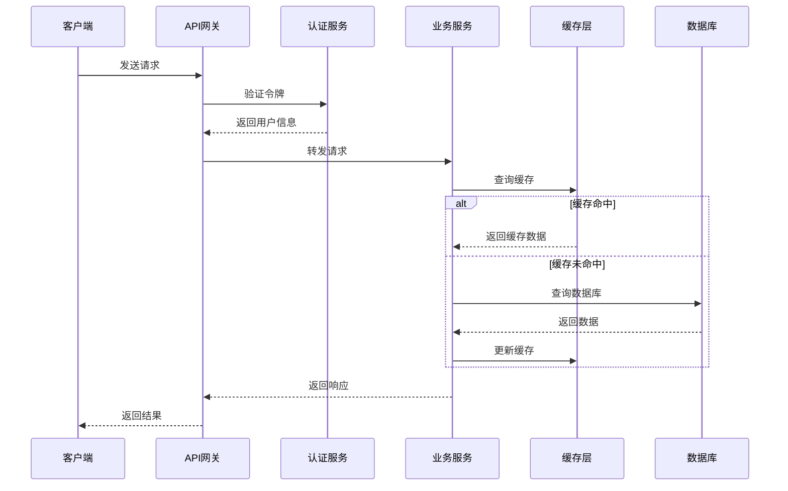
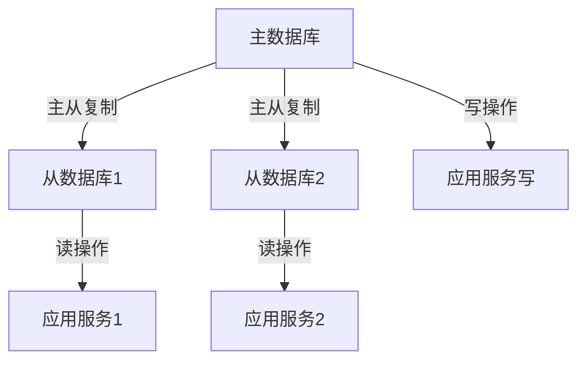
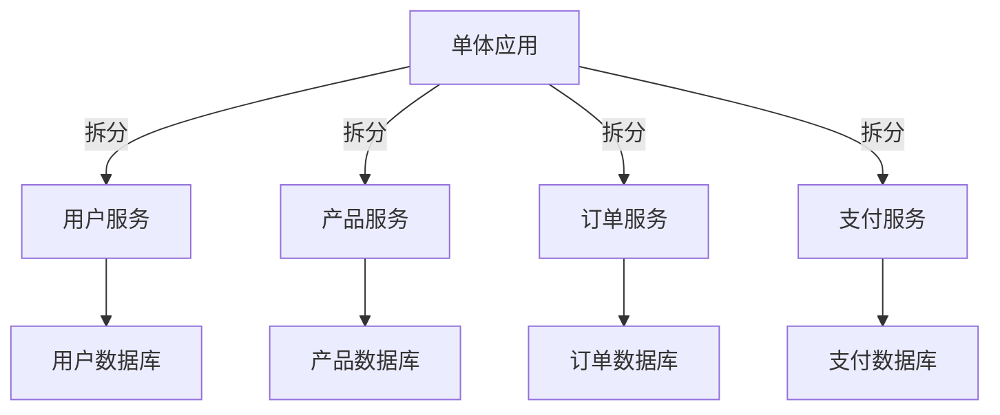
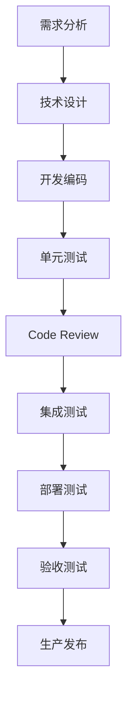

# 技术交付文档包

**项目名称：** [项目名称]  
**版本：** v1.0.0  
**文档版本：** 1.0  
**创建日期：** 2025年8月26日  
**最后更新：** 2025年8月26日  
**作者：** MiniMax Agent  
**文档状态：** 正式版  

---

## 📋 目录

1. [项目源代码结构说明](#1-项目源代码结构说明)
2. [技术栈和依赖说明](#2-技术栈和依赖说明)
3. [本地开发环境搭建指南](#3-本地开发环境搭建指南)
4. [部署配置说明](#4-部署配置说明)
5. [API接口文档](#5-api接口文档)
6. [数据库结构说明](#6-数据库结构说明)
7. [系统架构图和技术文档](#7-系统架构图和技术文档)
8. [后续开发和维护指南](#8-后续开发和维护指南)

---

## 📄 文档概述

本技术交付文档包为技术人员提供了完整的项目开发、部署和维护信息。包含了从代码结构到系统架构，从环境搭建到后续维护的全方位技术指导。

### 文档使用说明

- **开发人员**：重点阅读第1、2、3章节，了解代码结构和开发环境
- **运维人员**：重点阅读第4、7、8章节，了解部署和维护方案
- **项目经理**：建议阅读所有章节，全面了解技术架构
- **新加入团队成员**：按顺序完整阅读所有章节

---

## 1. 项目源代码结构说明

### 1.1 总体结构概览

```
project-name/
├── README.md                     # 项目说明文档
├── package.json                  # 项目依赖配置
├── .gitignore                    # Git忽略文件配置
├── .env.example                  # 环境变量示例
├── docker-compose.yml            # Docker编排配置
├── Dockerfile                    # Docker镜像构建文件
├── nginx.conf                    # Nginx配置文件
├── docs/                         # 项目文档目录
│   ├── api/                      # API文档
│   ├── architecture/             # 架构设计文档
│   ├── deployment/               # 部署文档
│   └── development/              # 开发文档
├── scripts/                      # 脚本文件目录
│   ├── build.sh                  # 构建脚本
│   ├── deploy.sh                 # 部署脚本
│   ├── backup.sh                 # 备份脚本
│   └── init-db.sh                # 数据库初始化脚本
├── config/                       # 配置文件目录
│   ├── database.js               # 数据库配置
│   ├── redis.js                  # Redis配置
│   ├── email.js                  # 邮件服务配置
│   └── logger.js                 # 日志配置
├── src/                          # 源代码目录
│   ├── controllers/              # 控制器层
│   │   ├── auth.controller.js    # 认证控制器
│   │   ├── user.controller.js    # 用户控制器
│   │   └── product.controller.js # 产品控制器
│   ├── services/                 # 业务逻辑层
│   │   ├── auth.service.js       # 认证服务
│   │   ├── user.service.js       # 用户服务
│   │   ├── email.service.js      # 邮件服务
│   │   └── file.service.js       # 文件服务
│   ├── models/                   # 数据模型层
│   │   ├── User.js               # 用户模型
│   │   ├── Product.js            # 产品模型
│   │   └── Order.js              # 订单模型
│   ├── middleware/               # 中间件目录
│   │   ├── auth.middleware.js    # 认证中间件
│   │   ├── validation.middleware.js # 数据验证中间件
│   │   ├── cors.middleware.js    # 跨域中间件
│   │   └── logger.middleware.js  # 日志中间件
│   ├── routes/                   # 路由定义
│   │   ├── index.js              # 路由入口
│   │   ├── auth.routes.js        # 认证路由
│   │   ├── user.routes.js        # 用户路由
│   │   └── product.routes.js     # 产品路由
│   ├── utils/                    # 工具函数
│   │   ├── validator.js          # 数据验证工具
│   │   ├── crypto.js             # 加密工具
│   │   ├── datetime.js           # 日期时间工具
│   │   └── response.js           # 响应格式化工具
│   ├── database/                 # 数据库相关
│   │   ├── migrations/           # 数据库迁移文件
│   │   ├── seeders/              # 数据种子文件
│   │   └── connection.js         # 数据库连接配置
│   └── app.js                    # 应用程序入口
├── frontend/                     # 前端代码目录
│   ├── public/                   # 静态资源
│   │   ├── index.html            # HTML入口文件
│   │   ├── favicon.ico           # 网站图标
│   │   └── assets/               # 静态资源文件
│   ├── src/                      # 前端源代码
│   │   ├── components/           # 组件目录
│   │   │   ├── common/           # 通用组件
│   │   │   ├── forms/            # 表单组件
│   │   │   └── layout/           # 布局组件
│   │   ├── pages/                # 页面组件
│   │   │   ├── auth/             # 认证页面
│   │   │   ├── dashboard/        # 仪表板页面
│   │   │   └── products/         # 产品页面
│   │   ├── services/             # API服务
│   │   │   ├── api.js            # API基础配置
│   │   │   ├── auth.service.js   # 认证API服务
│   │   │   └── product.service.js # 产品API服务
│   │   ├── store/                # 状态管理
│   │   │   ├── index.js          # Store入口
│   │   │   ├── auth.store.js     # 认证状态
│   │   │   └── product.store.js  # 产品状态
│   │   ├── styles/               # 样式文件
│   │   │   ├── global.css        # 全局样式
│   │   │   ├── variables.css     # CSS变量
│   │   │   └── components/       # 组件样式
│   │   ├── utils/                # 前端工具函数
│   │   │   ├── constants.js      # 常量定义
│   │   │   ├── helpers.js        # 辅助函数
│   │   │   └── validators.js     # 表单验证
│   │   └── App.js                # 前端应用入口
│   ├── package.json              # 前端依赖配置
│   └── webpack.config.js         # Webpack配置
├── tests/                        # 测试文件目录
│   ├── unit/                     # 单元测试
│   │   ├── controllers/          # 控制器测试
│   │   ├── services/             # 服务测试
│   │   └── utils/                # 工具函数测试
│   ├── integration/              # 集成测试
│   │   ├── api/                  # API测试
│   │   └── database/             # 数据库测试
│   ├── fixtures/                 # 测试数据
│   └── helpers/                  # 测试辅助函数
└── logs/                         # 日志文件目录
    ├── access.log                # 访问日志
    ├── error.log                 # 错误日志
    └── application.log           # 应用日志
```

### 1.2 核心目录详细说明

#### 1.2.1 后端源代码目录（src/）

**控制器层（controllers/）**
- 负责处理HTTP请求和响应
- 调用相应的服务层方法
- 进行请求参数验证
- 返回标准化的JSON响应

**服务层（services/）**
- 包含核心业务逻辑
- 处理数据转换和业务规则
- 调用数据模型进行数据操作
- 集成第三方服务

**模型层（models/）**
- 定义数据结构和关系
- 包含数据库操作方法
- 实现数据验证规则
- 管理数据库连接

**中间件（middleware/）**
- 请求预处理和后处理
- 身份验证和授权
- 错误处理和日志记录
- 请求限流和安全防护

#### 1.2.2 前端代码目录（frontend/）

**组件目录（components/）**
- `common/`：可复用的通用组件
- `forms/`：表单相关组件
- `layout/`：页面布局组件

**页面目录（pages/）**
- 按功能模块组织的页面组件
- 每个页面包含自己的业务逻辑
- 使用组合的方式构建复杂页面

**状态管理（store/）**
- 全局状态管理
- 按模块划分状态
- 包含actions和mutations

#### 1.2.3 配置和脚本目录

**配置目录（config/）**
- 数据库连接配置
- 第三方服务配置
- 环境相关配置
- 日志配置

**脚本目录（scripts/）**
- 自动化构建脚本
- 部署脚本
- 数据库迁移脚本
- 备份和恢复脚本

### 1.3 代码组织规范

#### 1.3.1 命名规范

**文件命名**
- 使用小写字母和连字符：`user-controller.js`
- 模型文件使用大驼峰：`User.js`
- 测试文件添加`.test`或`.spec`后缀

**变量和函数命名**
- 使用驼峰命名法：`getUserById`
- 常量使用大写字母和下划线：`API_BASE_URL`
- 私有方法和变量添加下划线前缀：`_privateMethod`

**接口和路由命名**
- RESTful风格：`GET /api/users`, `POST /api/users`
- 版本化：`/api/v1/users`
- 使用复数形式：`/users`而不是`/user`

#### 1.3.2 代码结构规范

**模块导出规范**
```javascript
// 单一导出
module.exports = UserController;

// 多个导出
module.exports = {
  createUser,
  getUserById,
  updateUser,
  deleteUser
};

// ES6模块导出
export default UserService;
export { createUser, updateUser };
```

**错误处理规范**
```javascript
// 统一错误处理格式
class AppError extends Error {
  constructor(message, statusCode) {
    super(message);
    this.statusCode = statusCode;
    this.status = `${statusCode}`.startsWith('4') ? 'fail' : 'error';
    this.isOperational = true;
  }
}
```

### 1.4 版本控制策略

#### 1.4.1 分支管理策略

**主要分支**
- `main/master`：生产环境分支
- `develop`：开发环境分支
- `staging`：预发布环境分支

**功能分支**
- `feature/功能名称`：新功能开发
- `bugfix/bug编号`：Bug修复
- `hotfix/紧急修复`：生产环境紧急修复

**分支命名规范**
```
feature/user-authentication
bugfix/login-validation
hotfix/security-patch-001
```

#### 1.4.2 提交信息规范

```
<type>(<scope>): <subject>

<body>

<footer>
```

**提交类型**
- `feat`：新功能
- `fix`：Bug修复
- `docs`：文档更新
- `style`：代码格式化
- `refactor`：代码重构
- `test`：测试相关
- `chore`：构建过程或辅助工具变动

**示例**
```
feat(auth): add JWT token refresh mechanism

- Implement automatic token refresh
- Add refresh token validation
- Update authentication middleware

Closes #123
```

---

## 2. 技术栈和依赖说明

### 2.1 技术架构总览

本项目采用前后端分离架构，基于现代化的技术栈构建，确保高性能、高可用性和良好的可维护性。

### 2.2 后端技术栈

#### 2.2.1 核心框架和运行环境

**Node.js 18.x LTS**
- **选择理由**：LTS版本稳定性好，生态完善，性能优异
- **主要特性**：非阻塞I/O、事件驱动、轻量级
- **版本要求**：Node.js >= 18.0.0

**Express.js 4.18.x**
```json
{
  "express": "^4.18.2"
}
```
- **选择理由**：轻量级、灵活、中间件生态丰富
- **主要功能**：HTTP服务器、路由管理、中间件支持
- **相关中间件**：
  - `express-rate-limit`：请求限流
  - `express-validator`：数据验证
  - `compression`：响应压缩

#### 2.2.2 数据库和持久化

**PostgreSQL 15.x**
```json
{
  "pg": "^8.11.3",
  "pg-hstore": "^2.3.4"
}
```
- **选择理由**：ACID事务支持、JSON数据类型、强大的查询能力
- **连接池**：使用`pg-pool`管理连接
- **迁移工具**：`knex.js`或`sequelize`

**Redis 7.x**
```json
{
  "redis": "^4.6.8",
  "ioredis": "^5.3.2"
}
```
- **选择理由**：高性能缓存、会话存储、消息队列
- **使用场景**：
  - 会话存储
  - API响应缓存
  - 分布式锁
  - 实时数据缓存

**Sequelize ORM**
```json
{
  "sequelize": "^6.32.1",
  "sequelize-cli": "^6.6.1"
}
```
- **选择理由**：成熟的ORM、支持多种数据库、迁移管理
- **功能**：模型定义、关系映射、查询优化

#### 2.2.3 身份验证和安全

**JWT认证**
```json
{
  "jsonwebtoken": "^9.0.2",
  "bcryptjs": "^2.4.3"
}
```
- **JWT**：无状态认证、跨域支持
- **bcryptjs**：密码加密和验证
- **passport.js**：多种认证策略支持

**安全中间件**
```json
{
  "helmet": "^7.0.0",
  "cors": "^2.8.5",
  "express-mongo-sanitize": "^2.2.0"
}
```
- **helmet**：HTTP安全头设置
- **cors**：跨域资源共享配置
- **mongo-sanitize**：防止NoSQL注入

#### 2.2.4 API文档和测试

**API文档**
```json
{
  "swagger-jsdoc": "^6.2.8",
  "swagger-ui-express": "^5.0.0"
}
```
- **swagger-jsdoc**：代码注释生成API文档
- **swagger-ui-express**：API文档界面

**测试框架**
```json
{
  "jest": "^29.6.4",
  "supertest": "^6.3.3",
  "eslint": "^8.47.0"
}
```
- **Jest**：单元测试和集成测试
- **Supertest**：API测试
- **ESLint**：代码质量检查

#### 2.2.5 日志和监控

**日志管理**
```json
{
  "winston": "^3.10.0",
  "morgan": "^1.10.0"
}
```
- **winston**：结构化日志记录
- **morgan**：HTTP请求日志

**性能监控**
```json
{
  "prom-client": "^14.2.0"
}
```
- **prometheus客户端**：指标收集和监控

### 2.3 前端技术栈

#### 2.3.1 核心框架

**React 18.x**
```json
{
  "react": "^18.2.0",
  "react-dom": "^18.2.0",
  "react-router-dom": "^6.15.0"
}
```
- **选择理由**：组件化、虚拟DOM、生态完善
- **Router**：单页应用路由管理
- **Hooks**：函数式组件状态管理

**TypeScript**
```json
{
  "typescript": "^5.1.6",
  "@types/react": "^18.2.20"
}
```
- **选择理由**：类型安全、IDE支持、代码可维护性
- **配置**：严格模式，支持ES2020

#### 2.3.2 UI组件和样式

**Ant Design**
```json
{
  "antd": "^5.8.6",
  "@ant-design/icons": "^5.2.6"
}
```
- **选择理由**：丰富的组件库、企业级设计语言
- **组件**：表单、表格、导航、反馈组件

**样式方案**
```json
{
  "styled-components": "^6.0.7",
  "tailwindcss": "^3.3.3"
}
```
- **styled-components**：CSS-in-JS解决方案
- **Tailwind CSS**：原子化CSS框架

#### 2.3.3 状态管理

**Redux Toolkit**
```json
{
  "redux": "^4.2.1",
  "@reduxjs/toolkit": "^1.9.5",
  "react-redux": "^8.1.2"
}
```
- **选择理由**：可预测的状态管理、时间旅行调试
- **RTK Query**：数据获取和缓存

**React Query**
```json
{
  "@tanstack/react-query": "^4.32.6"
}
```
- **选择理由**：服务端状态管理、自动缓存、重新获取

#### 2.3.4 开发和构建工具

**Vite**
```json
{
  "vite": "^4.4.9",
  "@vitejs/plugin-react": "^4.0.4"
}
```
- **选择理由**：快速的开发服务器、热更新、现代化构建
- **插件生态**：React支持、TypeScript支持

**代码质量工具**
```json
{
  "eslint": "^8.47.0",
  "prettier": "^3.0.2",
  "husky": "^8.0.3",
  "lint-staged": "^13.2.3"
}
```
- **ESLint**：代码规范检查
- **Prettier**：代码格式化
- **Husky**：Git钩子管理
- **lint-staged**：暂存文件检查

### 2.4 DevOps和基础设施

#### 2.4.1 容器化

**Docker**
```dockerfile
# Dockerfile示例
FROM node:18-alpine
WORKDIR /app
COPY package*.json ./
RUN npm ci --only=production
COPY . .
EXPOSE 3000
CMD ["npm", "start"]
```

**Docker Compose**
```yaml
# docker-compose.yml
version: '3.8'
services:
  app:
    build: .
    ports:
      - "3000:3000"
  postgres:
    image: postgres:15
    environment:
      POSTGRES_DB: myapp
      POSTGRES_PASSWORD: password
  redis:
    image: redis:7-alpine
```

#### 2.4.2 CI/CD工具

**GitHub Actions / GitLab CI**
- 自动化测试和部署
- 代码质量检查
- 安全扫描
- Docker镜像构建

**部署工具**
- **Kubernetes**：容器编排
- **Helm**：应用包管理
- **Terraform**：基础设施即代码

#### 2.4.3 监控和日志

**监控系统**
- **Prometheus**：指标收集
- **Grafana**：可视化监控面板
- **AlertManager**：告警管理

**日志系统**
- **ELK Stack**：日志收集和分析
- **Fluentd**：日志路由
- **Filebeat**：日志采集

### 2.5 第三方服务和集成

#### 2.5.1 云服务

**AWS服务**
- **EC2**：虚拟服务器
- **RDS**：托管数据库
- **S3**：对象存储
- **CloudFront**：CDN分发
- **Lambda**：无服务器计算

**阿里云服务**
- **ECS**：云服务器
- **RDS**：云数据库
- **OSS**：对象存储
- **CDN**：内容分发网络

#### 2.5.2 第三方集成

**支付服务**
```json
{
  "stripe": "^12.18.0",
  "alipay-sdk": "^3.4.0"
}
```

**消息通知**
```json
{
  "nodemailer": "^6.9.4",
  "twilio": "^4.14.0"
}
```

**文件上传**
```json
{
  "multer": "^1.4.5-lts.1",
  "aws-sdk": "^2.1447.0"
}
```

### 2.6 依赖版本管理

#### 2.6.1 版本锁定策略

**package.json版本范围**
```json
{
  "dependencies": {
    "express": "^4.18.2",
    "react": "~18.2.0",
    "lodash": "4.17.21"
  }
}
```

**版本符号说明**
- `^4.18.2`：兼容性更新（4.x.x）
- `~18.2.0`：补丁更新（18.2.x）
- `4.17.21`：精确版本

#### 2.6.2 依赖更新策略

**定期更新计划**
- **月度**：补丁版本更新
- **季度**：小版本更新
- **年度**：主版本更新

**安全更新**
- 使用`npm audit`检查安全漏洞
- 及时应用安全补丁
- 监控CVE数据库

### 2.7 性能和优化

#### 2.7.1 前端优化

**代码分割**
```javascript
// React lazy loading
const ProductPage = lazy(() => import('./pages/ProductPage'));
```

**资源优化**
- 图片压缩和格式优化
- CSS和JS文件压缩
- 浏览器缓存策略

#### 2.7.2 后端优化

**数据库优化**
- 索引优化
- 查询优化
- 连接池配置

**API优化**
- 响应缓存
- 分页查询
- 数据压缩

---

## 3. 本地开发环境搭建指南

### 3.1 环境要求

#### 3.1.1 系统要求

**操作系统支持**
- Windows 10/11 (x64)
- macOS 12.0+ (Intel/Apple Silicon)
- Linux (Ubuntu 20.04+, CentOS 8+)

**硬件要求**
- CPU: 4核心以上
- 内存: 8GB以上（推荐16GB）
- 硬盘: 20GB可用空间
- 网络: 稳定的网络连接

#### 3.1.2 必需软件版本

| 软件 | 版本要求 | 下载地址 |
|------|----------|----------|
| Node.js | 18.0.0+ | https://nodejs.org |
| npm | 9.0.0+ | 随Node.js安装 |
| Git | 2.30.0+ | https://git-scm.com |
| Docker | 20.10.0+ | https://docker.com |
| Docker Compose | 2.0.0+ | https://docs.docker.com/compose |

### 3.2 软件安装指南

#### 3.2.1 Node.js安装

**Windows安装**
```bash
# 下载并安装Node.js LTS版本
# 访问 https://nodejs.org 下载Windows安装包
# 运行安装程序，按照提示完成安装

# 验证安装
node --version
npm --version
```

**macOS安装**
```bash
# 使用Homebrew安装
brew install node@18

# 或下载官方安装包
# 访问 https://nodejs.org 下载macOS安装包

# 验证安装
node --version
npm --version
```

**Linux安装**
```bash
# Ubuntu/Debian
curl -fsSL https://deb.nodesource.com/setup_18.x | sudo -E bash -
sudo apt-get install -y nodejs

# CentOS/RHEL
curl -fsSL https://rpm.nodesource.com/setup_18.x | sudo bash -
sudo yum install -y nodejs

# 验证安装
node --version
npm --version
```

#### 3.2.2 Docker安装

**Windows安装**
```bash
# 下载Docker Desktop for Windows
# 访问 https://docs.docker.com/desktop/windows/install/
# 下载并运行安装程序

# 验证安装
docker --version
docker-compose --version
```

**macOS安装**
```bash
# 下载Docker Desktop for Mac
# 访问 https://docs.docker.com/desktop/mac/install/

# 或使用Homebrew
brew install --cask docker

# 验证安装
docker --version
docker-compose --version
```

**Linux安装**
```bash
# Ubuntu安装Docker
sudo apt-get update
sudo apt-get install -y apt-transport-https ca-certificates curl gnupg lsb-release

curl -fsSL https://download.docker.com/linux/ubuntu/gpg | sudo gpg --dearmor -o /usr/share/keyrings/docker-archive-keyring.gpg

echo "deb [arch=amd64 signed-by=/usr/share/keyrings/docker-archive-keyring.gpg] https://download.docker.com/linux/ubuntu $(lsb_release -cs) stable" | sudo tee /etc/apt/sources.list.d/docker.list > /dev/null

sudo apt-get update
sudo apt-get install -y docker-ce docker-ce-cli containerd.io

# 安装Docker Compose
sudo curl -L "https://github.com/docker/compose/releases/latest/download/docker-compose-$(uname -s)-$(uname -m)" -o /usr/local/bin/docker-compose
sudo chmod +x /usr/local/bin/docker-compose

# 验证安装
docker --version
docker-compose --version
```

#### 3.2.3 开发工具推荐

**代码编辑器**
```bash
# Visual Studio Code (推荐)
# 下载地址：https://code.visualstudio.com/

# 推荐扩展插件
# - ES7+ React/Redux/React-Native snippets
# - Prettier - Code formatter
# - ESLint
# - Auto Rename Tag
# - Thunder Client (API测试)
# - Docker
# - GitLens
```

**数据库管理工具**
```bash
# DBeaver (免费，支持多种数据库)
# 下载地址：https://dbeaver.io/

# pgAdmin (PostgreSQL专用)
# 下载地址：https://www.pgadmin.org/

# Redis Desktop Manager
# 下载地址：https://resp.app/
```

### 3.3 项目克隆和安装

#### 3.3.1 代码克隆

```bash
# 克隆项目代码
git clone https://github.com/your-organization/your-project.git
cd your-project

# 查看分支
git branch -a

# 切换到开发分支
git checkout develop
```

#### 3.3.2 环境配置

**创建环境变量文件**
```bash
# 复制环境变量模板
cp .env.example .env

# 编辑环境变量
nano .env
```

**环境变量配置示例**
```bash
# .env 文件内容
# 应用配置
NODE_ENV=development
PORT=3000
APP_NAME=MyApp
APP_URL=http://localhost:3000

# 数据库配置
DB_HOST=localhost
DB_PORT=5432
DB_NAME=myapp_dev
DB_USERNAME=postgres
DB_PASSWORD=password

# Redis配置
REDIS_HOST=localhost
REDIS_PORT=6379
REDIS_PASSWORD=

# JWT配置
JWT_SECRET=your-super-secret-jwt-key
JWT_EXPIRES_IN=7d
JWT_REFRESH_EXPIRES_IN=30d

# 邮件配置
MAIL_HOST=smtp.gmail.com
MAIL_PORT=587
MAIL_USERNAME=your-email@gmail.com
MAIL_PASSWORD=your-app-password

# 文件上传配置
UPLOAD_PATH=./uploads
MAX_FILE_SIZE=10485760

# 第三方服务配置
AWS_ACCESS_KEY_ID=your-aws-access-key
AWS_SECRET_ACCESS_KEY=your-aws-secret-key
AWS_REGION=us-east-1
AWS_S3_BUCKET=your-s3-bucket

# API配置
API_RATE_LIMIT=100
API_RATE_WINDOW=15
```

#### 3.3.3 依赖安装

**后端依赖安装**
```bash
# 安装后端依赖
npm install

# 或使用npm ci进行快速安装
npm ci

# 全局安装开发工具
npm install -g nodemon
npm install -g sequelize-cli
```

**前端依赖安装**
```bash
# 进入前端目录
cd frontend

# 安装前端依赖
npm install

# 返回项目根目录
cd ..
```

### 3.4 数据库设置

#### 3.4.1 使用Docker启动数据库

**启动数据库服务**
```bash
# 启动PostgreSQL和Redis
docker-compose up -d postgres redis

# 查看运行状态
docker-compose ps

# 查看日志
docker-compose logs postgres
docker-compose logs redis
```

**docker-compose.yml示例**
```yaml
version: '3.8'

services:
  postgres:
    image: postgres:15
    container_name: myapp_postgres
    environment:
      POSTGRES_DB: myapp_dev
      POSTGRES_USER: postgres
      POSTGRES_PASSWORD: password
    ports:
      - "5432:5432"
    volumes:
      - postgres_data:/var/lib/postgresql/data
      - ./database/init.sql:/docker-entrypoint-initdb.d/init.sql
    networks:
      - myapp_network

  redis:
    image: redis:7-alpine
    container_name: myapp_redis
    ports:
      - "6379:6379"
    volumes:
      - redis_data:/data
    networks:
      - myapp_network

volumes:
  postgres_data:
  redis_data:

networks:
  myapp_network:
    driver: bridge
```

#### 3.4.2 数据库初始化

**运行数据库迁移**
```bash
# 创建数据库（如果不存在）
npm run db:create

# 运行迁移
npm run db:migrate

# 运行种子数据
npm run db:seed
```

**package.json脚本配置**
```json
{
  "scripts": {
    "db:create": "sequelize-cli db:create",
    "db:migrate": "sequelize-cli db:migrate",
    "db:migrate:undo": "sequelize-cli db:migrate:undo",
    "db:seed": "sequelize-cli db:seed:all",
    "db:seed:undo": "sequelize-cli db:seed:undo:all",
    "db:reset": "npm run db:migrate:undo:all && npm run db:migrate && npm run db:seed"
  }
}
```

#### 3.4.3 数据库连接测试

**连接测试脚本**
```javascript
// scripts/test-db.js
const { Sequelize } = require('sequelize');
require('dotenv').config();

const sequelize = new Sequelize(
  process.env.DB_NAME,
  process.env.DB_USERNAME,
  process.env.DB_PASSWORD,
  {
    host: process.env.DB_HOST,
    port: process.env.DB_PORT,
    dialect: 'postgres'
  }
);

async function testConnection() {
  try {
    await sequelize.authenticate();
    console.log('✅ 数据库连接成功');
  } catch (error) {
    console.error('❌ 数据库连接失败:', error.message);
  } finally {
    await sequelize.close();
  }
}

testConnection();
```

**运行连接测试**
```bash
# 测试数据库连接
node scripts/test-db.js
```

### 3.5 开发服务器启动

#### 3.5.1 启动后端服务

**开发模式启动**
```bash
# 使用nodemon启动（支持热重载）
npm run dev

# 或直接启动
npm start

# 指定端口启动
PORT=3001 npm run dev
```

**package.json启动脚本**
```json
{
  "scripts": {
    "start": "node src/app.js",
    "dev": "nodemon src/app.js",
    "dev:debug": "DEBUG=* nodemon src/app.js",
    "test": "jest",
    "test:watch": "jest --watch",
    "lint": "eslint src/",
    "lint:fix": "eslint src/ --fix"
  }
}
```

#### 3.5.2 启动前端服务

```bash
# 进入前端目录
cd frontend

# 启动前端开发服务器
npm run dev

# 或使用Vite启动
npx vite

# 指定端口启动
npm run dev -- --port 3001
```

**前端package.json脚本**
```json
{
  "scripts": {
    "dev": "vite",
    "build": "vite build",
    "build:staging": "vite build --mode staging",
    "build:production": "vite build --mode production",
    "preview": "vite preview",
    "test": "vitest",
    "test:ui": "vitest --ui",
    "lint": "eslint src/",
    "lint:fix": "eslint src/ --fix",
    "type-check": "tsc --noEmit"
  }
}
```

### 3.6 开发环境验证

#### 3.6.1 服务状态检查

**后端服务检查**
```bash
# 检查后端服务
curl http://localhost:3000/api/health

# 查看API文档
open http://localhost:3000/api-docs
```

**前端服务检查**
```bash
# 检查前端服务
open http://localhost:3001
```

#### 3.6.2 数据库连接检查

**PostgreSQL连接检查**
```bash
# 使用psql连接
psql -h localhost -p 5432 -U postgres -d myapp_dev

# 查看表结构
\dt

# 退出
\q
```

**Redis连接检查**
```bash
# 使用redis-cli连接
redis-cli -h localhost -p 6379

# 测试连接
ping

# 退出
exit
```

#### 3.6.3 运行测试

```bash
# 运行后端测试
npm test

# 运行前端测试
cd frontend
npm test

# 运行测试覆盖率
npm run test:coverage
```

### 3.7 常见问题解决

#### 3.7.1 端口占用问题

```bash
# 查看端口占用
lsof -i :3000
netstat -tulpn | grep :3000

# 杀死占用端口的进程
kill -9 <PID>

# Windows下查看端口占用
netstat -ano | findstr :3000
taskkill /PID <PID> /F
```

#### 3.7.2 依赖安装问题

```bash
# 清除npm缓存
npm cache clean --force

# 删除node_modules重新安装
rm -rf node_modules package-lock.json
npm install

# 使用npm ci进行干净安装
npm ci
```

#### 3.7.3 数据库连接问题

**PostgreSQL连接失败**
```bash
# 检查Docker容器状态
docker ps
docker logs myapp_postgres

# 重启PostgreSQL容器
docker-compose restart postgres

# 检查防火墙设置（Linux）
sudo ufw status
sudo ufw allow 5432
```

**Redis连接失败**
```bash
# 检查Redis状态
docker logs myapp_redis

# 重启Redis容器
docker-compose restart redis
```

### 3.8 IDE配置

#### 3.8.1 VS Code配置

**推荐扩展列表**
```json
// .vscode/extensions.json
{
  "recommendations": [
    "ms-vscode.vscode-typescript-next",
    "bradlc.vscode-tailwindcss",
    "esbenp.prettier-vscode",
    "ms-vscode.vscode-eslint",
    "formulahendry.auto-rename-tag",
    "ms-azuretools.vscode-docker",
    "eamodio.gitlens",
    "rangav.vscode-thunder-client"
  ]
}
```

**VS Code设置**
```json
// .vscode/settings.json
{
  "editor.formatOnSave": true,
  "editor.defaultFormatter": "esbenp.prettier-vscode",
  "editor.codeActionsOnSave": {
    "source.fixAll.eslint": true
  },
  "emmet.includeLanguages": {
    "javascript": "javascriptreact",
    "typescript": "typescriptreact"
  },
  "files.associations": {
    "*.css": "tailwindcss"
  }
}
```

**调试配置**
```json
// .vscode/launch.json
{
  "version": "0.2.0",
  "configurations": [
    {
      "name": "Launch Backend",
      "type": "node",
      "request": "launch",
      "program": "${workspaceFolder}/src/app.js",
      "env": {
        "NODE_ENV": "development"
      },
      "console": "integratedTerminal"
    }
  ]
}
```

#### 3.8.2 Git配置

**Git钩子配置**
```bash
# 初始化husky
npx husky-init && npm install

# 添加pre-commit钩子
npx husky add .husky/pre-commit "npm run lint"
npx husky add .husky/pre-push "npm test"
```

**.gitignore文件**
```
# Dependencies
node_modules/
npm-debug.log*
yarn-debug.log*
yarn-error.log*

# Production build
/build
/dist

# Environment variables
.env
.env.local
.env.staging
.env.production

# Logs
logs/
*.log

# Database
*.db
*.sqlite

# IDE
.vscode/
.idea/
*.swp
*.swo

# OS
.DS_Store
Thumbs.db

# Docker
.docker/

# Coverage
coverage/
```

现在开发环境搭建指南已经完成，接下来继续编写部署配置说明。

---

## 4. 部署配置说明

### 4.1 部署架构概述

本项目支持多种部署方式，包括传统服务器部署、容器化部署和云原生部署。推荐使用容器化部署方式，便于管理和扩展。

### 4.2 部署环境分类

#### 4.2.1 环境类型

**开发环境（Development）**
- **用途**：日常开发和测试
- **特点**：实时重载、详细日志、调试模式
- **域名**：dev.yourapp.com
- **数据库**：独立的开发数据库

**预发布环境（Staging）**
- **用途**：功能测试和集成测试
- **特点**：接近生产环境配置
- **域名**：staging.yourapp.com
- **数据库**：生产数据的副本

**生产环境（Production）**
- **用途**：正式运行环境
- **特点**：高可用、性能优化、安全加固
- **域名**：yourapp.com
- **数据库**：生产数据库

#### 4.2.2 环境配置差异

| 配置项 | 开发环境 | 预发布环境 | 生产环境 |
|--------|----------|------------|----------|
| 日志级别 | debug | info | error |
| 缓存策略 | 关闭 | 开启 | 开启 |
| 代码压缩 | 否 | 是 | 是 |
| HTTPS | 否 | 是 | 是 |
| 数据库连接池 | 5 | 10 | 20 |
| Redis集群 | 单实例 | 主从 | 集群 |

### 4.3 Docker部署

#### 4.3.1 Dockerfile优化

**后端Dockerfile**
```dockerfile
# 多阶段构建 - 构建阶段
FROM node:18-alpine AS builder

# 设置工作目录
WORKDIR /app

# 复制依赖文件
COPY package*.json ./
COPY .npmrc ./

# 安装依赖（仅生产依赖）
RUN npm ci --only=production

# 复制源代码
COPY . .

# 构建应用
RUN npm run build

# 运行阶段
FROM node:18-alpine AS runner

# 创建非root用户
RUN addgroup --system --gid 1001 nodejs
RUN adduser --system --uid 1001 nextjs

# 设置工作目录
WORKDIR /app

# 复制构建产物
COPY --from=builder --chown=nextjs:nodejs /app/dist ./dist
COPY --from=builder --chown=nextjs:nodejs /app/node_modules ./node_modules
COPY --from=builder --chown=nextjs:nodejs /app/package.json ./package.json

# 创建日志目录
RUN mkdir -p logs && chown nextjs:nodejs logs

# 切换到非root用户
USER nextjs

# 暴露端口
EXPOSE 3000

# 健康检查
HEALTHCHECK --interval=30s --timeout=3s --start-period=5s --retries=3 \
  CMD curl -f http://localhost:3000/api/health || exit 1

# 启动应用
CMD ["npm", "start"]
```

**前端Dockerfile**
```dockerfile
# 构建阶段
FROM node:18-alpine AS builder

WORKDIR /app

# 复制依赖文件
COPY package*.json ./
RUN npm ci

# 复制源代码并构建
COPY . .
RUN npm run build

# Nginx运行阶段
FROM nginx:alpine AS runner

# 复制nginx配置
COPY nginx.conf /etc/nginx/nginx.conf

# 复制构建产物
COPY --from=builder /app/dist /usr/share/nginx/html

# 暴露端口
EXPOSE 80

# 启动nginx
CMD ["nginx", "-g", "daemon off;"]
```

#### 4.3.2 Docker Compose生产配置

**docker-compose.prod.yml**
```yaml
version: '3.8'

services:
  # Nginx反向代理
  nginx:
    image: nginx:alpine
    container_name: myapp_nginx
    ports:
      - "80:80"
      - "443:443"
    volumes:
      - ./nginx/nginx.conf:/etc/nginx/nginx.conf:ro
      - ./nginx/ssl:/etc/nginx/ssl:ro
      - ./logs/nginx:/var/log/nginx
    depends_on:
      - backend
      - frontend
    networks:
      - myapp_network
    restart: unless-stopped

  # 前端应用
  frontend:
    build:
      context: ./frontend
      dockerfile: Dockerfile
    container_name: myapp_frontend
    networks:
      - myapp_network
    restart: unless-stopped

  # 后端应用
  backend:
    build:
      context: .
      dockerfile: Dockerfile
    container_name: myapp_backend
    environment:
      - NODE_ENV=production
      - DB_HOST=postgres
      - REDIS_HOST=redis
    depends_on:
      - postgres
      - redis
    volumes:
      - ./logs:/app/logs
      - ./uploads:/app/uploads
    networks:
      - myapp_network
    restart: unless-stopped

  # PostgreSQL数据库
  postgres:
    image: postgres:15
    container_name: myapp_postgres
    environment:
      POSTGRES_DB: ${DB_NAME}
      POSTGRES_USER: ${DB_USERNAME}
      POSTGRES_PASSWORD: ${DB_PASSWORD}
    volumes:
      - postgres_data:/var/lib/postgresql/data
      - ./database/backup:/backup
    networks:
      - myapp_network
    restart: unless-stopped

  # Redis缓存
  redis:
    image: redis:7-alpine
    container_name: myapp_redis
    command: redis-server --requirepass ${REDIS_PASSWORD}
    volumes:
      - redis_data:/data
    networks:
      - myapp_network
    restart: unless-stopped

  # 监控服务
  prometheus:
    image: prom/prometheus
    container_name: myapp_prometheus
    ports:
      - "9090:9090"
    volumes:
      - ./monitoring/prometheus.yml:/etc/prometheus/prometheus.yml:ro
    networks:
      - myapp_network
    restart: unless-stopped

  grafana:
    image: grafana/grafana
    container_name: myapp_grafana
    ports:
      - "3000:3000"
    environment:
      - GF_SECURITY_ADMIN_PASSWORD=${GRAFANA_PASSWORD}
    volumes:
      - grafana_data:/var/lib/grafana
    networks:
      - myapp_network
    restart: unless-stopped

volumes:
  postgres_data:
  redis_data:
  grafana_data:

networks:
  myapp_network:
    driver: bridge
```

#### 4.3.3 Nginx配置

**nginx/nginx.conf**
```nginx
user nginx;
worker_processes auto;
error_log /var/log/nginx/error.log warn;
pid /var/run/nginx.pid;

events {
    worker_connections 1024;
    use epoll;
    multi_accept on;
}

http {
    include /etc/nginx/mime.types;
    default_type application/octet-stream;

    # 日志格式
    log_format main '$remote_addr - $remote_user [$time_local] "$request" '
                    '$status $body_bytes_sent "$http_referer" '
                    '"$http_user_agent" "$http_x_forwarded_for"';

    access_log /var/log/nginx/access.log main;

    # 基础配置
    sendfile on;
    tcp_nopush on;
    tcp_nodelay on;
    keepalive_timeout 65;
    types_hash_max_size 2048;
    client_max_body_size 16M;

    # Gzip压缩
    gzip on;
    gzip_vary on;
    gzip_comp_level 6;
    gzip_min_length 1000;
    gzip_types
        text/plain
        text/css
        text/xml
        text/javascript
        application/json
        application/javascript
        application/xml+rss
        application/atom+xml
        image/svg+xml;

    # 安全头
    add_header X-Frame-Options "SAMEORIGIN" always;
    add_header X-XSS-Protection "1; mode=block" always;
    add_header X-Content-Type-Options "nosniff" always;
    add_header Referrer-Policy "no-referrer-when-downgrade" always;

    # 上游服务器
    upstream backend {
        server backend:3000;
        keepalive 32;
    }

    # 限制请求
    limit_req_zone $binary_remote_addr zone=api:10m rate=10r/s;

    # HTTP重定向到HTTPS
    server {
        listen 80;
        server_name yourapp.com www.yourapp.com;
        return 301 https://$server_name$request_uri;
    }

    # HTTPS主站
    server {
        listen 443 ssl http2;
        server_name yourapp.com www.yourapp.com;

        # SSL配置
        ssl_certificate /etc/nginx/ssl/cert.pem;
        ssl_certificate_key /etc/nginx/ssl/key.pem;
        ssl_session_timeout 1d;
        ssl_session_cache shared:SSL:10m;
        ssl_session_tickets off;

        # SSL协议配置
        ssl_protocols TLSv1.2 TLSv1.3;
        ssl_ciphers ECDHE-RSA-AES128-GCM-SHA256:ECDHE-RSA-AES256-GCM-SHA384;
        ssl_prefer_server_ciphers off;

        # HSTS
        add_header Strict-Transport-Security "max-age=63072000" always;

        # 静态文件
        location / {
            proxy_pass http://frontend:80;
            proxy_http_version 1.1;
            proxy_set_header Upgrade $http_upgrade;
            proxy_set_header Connection 'upgrade';
            proxy_set_header Host $host;
            proxy_set_header X-Real-IP $remote_addr;
            proxy_set_header X-Forwarded-For $proxy_add_x_forwarded_for;
            proxy_set_header X-Forwarded-Proto $scheme;
            proxy_cache_bypass $http_upgrade;
        }

        # API接口
        location /api {
            limit_req zone=api burst=20 nodelay;
            
            proxy_pass http://backend;
            proxy_http_version 1.1;
            proxy_set_header Upgrade $http_upgrade;
            proxy_set_header Connection 'upgrade';
            proxy_set_header Host $host;
            proxy_set_header X-Real-IP $remote_addr;
            proxy_set_header X-Forwarded-For $proxy_add_x_forwarded_for;
            proxy_set_header X-Forwarded-Proto $scheme;
            proxy_cache_bypass $http_upgrade;
            
            # 超时设置
            proxy_connect_timeout 30s;
            proxy_send_timeout 60s;
            proxy_read_timeout 60s;
        }

        # 静态资源缓存
        location ~* \.(js|css|png|jpg|jpeg|gif|ico|svg)$ {
            expires 1y;
            add_header Cache-Control "public, immutable";
            try_files $uri =404;
        }

        # 健康检查
        location /health {
            access_log off;
            return 200 "healthy\n";
            add_header Content-Type text/plain;
        }
    }
}
```

### 4.4 Kubernetes部署

#### 4.4.1 基础配置文件

**namespace.yaml**
```yaml
apiVersion: v1
kind: Namespace
metadata:
  name: myapp
  labels:
    name: myapp
```

**configmap.yaml**
```yaml
apiVersion: v1
kind: ConfigMap
metadata:
  name: myapp-config
  namespace: myapp
data:
  NODE_ENV: "production"
  DB_HOST: "postgres-service"
  REDIS_HOST: "redis-service"
  API_RATE_LIMIT: "100"
```

**secret.yaml**
```yaml
apiVersion: v1
kind: Secret
metadata:
  name: myapp-secrets
  namespace: myapp
type: Opaque
data:
  DB_PASSWORD: <base64-encoded-password>
  JWT_SECRET: <base64-encoded-jwt-secret>
  REDIS_PASSWORD: <base64-encoded-redis-password>
```

#### 4.4.2 应用部署配置

**backend-deployment.yaml**
```yaml
apiVersion: apps/v1
kind: Deployment
metadata:
  name: backend-deployment
  namespace: myapp
spec:
  replicas: 3
  selector:
    matchLabels:
      app: backend
  template:
    metadata:
      labels:
        app: backend
    spec:
      containers:
      - name: backend
        image: myapp/backend:latest
        ports:
        - containerPort: 3000
        env:
        - name: NODE_ENV
          valueFrom:
            configMapKeyRef:
              name: myapp-config
              key: NODE_ENV
        - name: DB_PASSWORD
          valueFrom:
            secretKeyRef:
              name: myapp-secrets
              key: DB_PASSWORD
        resources:
          limits:
            cpu: 500m
            memory: 512Mi
          requests:
            cpu: 250m
            memory: 256Mi
        livenessProbe:
          httpGet:
            path: /api/health
            port: 3000
          initialDelaySeconds: 30
          periodSeconds: 10
        readinessProbe:
          httpGet:
            path: /api/ready
            port: 3000
          initialDelaySeconds: 5
          periodSeconds: 5
---
apiVersion: v1
kind: Service
metadata:
  name: backend-service
  namespace: myapp
spec:
  selector:
    app: backend
  ports:
    - protocol: TCP
      port: 80
      targetPort: 3000
  type: ClusterIP
```

**frontend-deployment.yaml**
```yaml
apiVersion: apps/v1
kind: Deployment
metadata:
  name: frontend-deployment
  namespace: myapp
spec:
  replicas: 2
  selector:
    matchLabels:
      app: frontend
  template:
    metadata:
      labels:
        app: frontend
    spec:
      containers:
      - name: frontend
        image: myapp/frontend:latest
        ports:
        - containerPort: 80
        resources:
          limits:
            cpu: 200m
            memory: 256Mi
          requests:
            cpu: 100m
            memory: 128Mi
---
apiVersion: v1
kind: Service
metadata:
  name: frontend-service
  namespace: myapp
spec:
  selector:
    app: frontend
  ports:
    - protocol: TCP
      port: 80
      targetPort: 80
  type: ClusterIP
```

#### 4.4.3 Ingress配置

**ingress.yaml**
```yaml
apiVersion: networking.k8s.io/v1
kind: Ingress
metadata:
  name: myapp-ingress
  namespace: myapp
  annotations:
    kubernetes.io/ingress.class: nginx
    cert-manager.io/cluster-issuer: letsencrypt-prod
    nginx.ingress.kubernetes.io/ssl-redirect: "true"
    nginx.ingress.kubernetes.io/rate-limit: "100"
spec:
  tls:
  - hosts:
    - yourapp.com
    - www.yourapp.com
    secretName: myapp-tls
  rules:
  - host: yourapp.com
    http:
      paths:
      - path: /api
        pathType: Prefix
        backend:
          service:
            name: backend-service
            port:
              number: 80
      - path: /
        pathType: Prefix
        backend:
          service:
            name: frontend-service
            port:
              number: 80
  - host: www.yourapp.com
    http:
      paths:
      - path: /api
        pathType: Prefix
        backend:
          service:
            name: backend-service
            port:
              number: 80
      - path: /
        pathType: Prefix
        backend:
          service:
            name: frontend-service
            port:
              number: 80
```

### 4.5 CI/CD流水线

#### 4.5.1 GitHub Actions配置

**.github/workflows/deploy.yml**
```yaml
name: CI/CD Pipeline

on:
  push:
    branches: [ main, develop ]
  pull_request:
    branches: [ main ]

env:
  NODE_VERSION: '18'
  DOCKER_REGISTRY: ghcr.io
  IMAGE_NAME: myapp

jobs:
  test:
    runs-on: ubuntu-latest
    
    services:
      postgres:
        image: postgres:15
        env:
          POSTGRES_PASSWORD: password
          POSTGRES_DB: test_db
        options: >-
          --health-cmd pg_isready
          --health-interval 10s
          --health-timeout 5s
          --health-retries 5
        ports:
          - 5432:5432

      redis:
        image: redis:7
        options: >-
          --health-cmd "redis-cli ping"
          --health-interval 10s
          --health-timeout 5s
          --health-retries 5
        ports:
          - 6379:6379

    steps:
    - uses: actions/checkout@v3
    
    - name: Setup Node.js
      uses: actions/setup-node@v3
      with:
        node-version: ${{ env.NODE_VERSION }}
        cache: 'npm'
    
    - name: Install dependencies
      run: npm ci
    
    - name: Run lint
      run: npm run lint
    
    - name: Run tests
      run: npm test
      env:
        NODE_ENV: test
        DB_HOST: localhost
        DB_PORT: 5432
        REDIS_HOST: localhost
        REDIS_PORT: 6379
    
    - name: Frontend tests
      run: |
        cd frontend
        npm ci
        npm test
    
    - name: Upload coverage to Codecov
      uses: codecov/codecov-action@v3

  build:
    needs: test
    runs-on: ubuntu-latest
    if: github.ref == 'refs/heads/main'
    
    steps:
    - uses: actions/checkout@v3
    
    - name: Set up Docker Buildx
      uses: docker/setup-buildx-action@v2
    
    - name: Login to Container Registry
      uses: docker/login-action@v2
      with:
        registry: ${{ env.DOCKER_REGISTRY }}
        username: ${{ github.actor }}
        password: ${{ secrets.GITHUB_TOKEN }}
    
    - name: Extract metadata
      id: meta
      uses: docker/metadata-action@v4
      with:
        images: ${{ env.DOCKER_REGISTRY }}/${{ github.repository }}/${{ env.IMAGE_NAME }}
        tags: |
          type=ref,event=branch
          type=ref,event=pr
          type=sha
    
    - name: Build and push Backend image
      uses: docker/build-push-action@v4
      with:
        context: .
        file: ./Dockerfile
        push: true
        tags: ${{ steps.meta.outputs.tags }}-backend
        labels: ${{ steps.meta.outputs.labels }}
        cache-from: type=gha
        cache-to: type=gha,mode=max
    
    - name: Build and push Frontend image
      uses: docker/build-push-action@v4
      with:
        context: ./frontend
        file: ./frontend/Dockerfile
        push: true
        tags: ${{ steps.meta.outputs.tags }}-frontend
        labels: ${{ steps.meta.outputs.labels }}
        cache-from: type=gha
        cache-to: type=gha,mode=max

  deploy:
    needs: build
    runs-on: ubuntu-latest
    if: github.ref == 'refs/heads/main'
    
    steps:
    - uses: actions/checkout@v3
    
    - name: Deploy to staging
      run: |
        echo "Deploying to staging environment"
        # 这里添加部署到预发布环境的脚本
    
    - name: Deploy to production
      if: github.event_name == 'push'
      run: |
        echo "Deploying to production environment"
        # 这里添加部署到生产环境的脚本
```

#### 4.5.2 部署脚本

**scripts/deploy.sh**
```bash
#!/bin/bash

set -e

# 配置变量
ENVIRONMENT=${1:-staging}
IMAGE_TAG=${2:-latest}
NAMESPACE="myapp-${ENVIRONMENT}"

echo "🚀 部署到 ${ENVIRONMENT} 环境"

# 检查kubectl连接
kubectl cluster-info

# 创建命名空间（如果不存在）
kubectl create namespace ${NAMESPACE} --dry-run=client -o yaml | kubectl apply -f -

# 应用配置文件
echo "📝 应用配置文件..."
envsubst < k8s/configmap.yaml | kubectl apply -f -
envsubst < k8s/secret.yaml | kubectl apply -f -

# 部署应用
echo "🎯 部署应用..."
envsubst < k8s/backend-deployment.yaml | kubectl apply -f -
envsubst < k8s/frontend-deployment.yaml | kubectl apply -f -

# 应用Ingress
if [ "$ENVIRONMENT" = "production" ]; then
    echo "🌐 配置Ingress..."
    envsubst < k8s/ingress.yaml | kubectl apply -f -
fi

# 等待部署完成
echo "⏳ 等待部署完成..."
kubectl rollout status deployment/backend-deployment -n ${NAMESPACE}
kubectl rollout status deployment/frontend-deployment -n ${NAMESPACE}

echo "✅ 部署完成！"

# 显示服务状态
kubectl get pods -n ${NAMESPACE}
kubectl get services -n ${NAMESPACE}
```

### 4.6 环境变量管理

#### 4.6.1 环境变量分类

**公开配置**
```bash
# 应用配置
NODE_ENV=production
PORT=3000
APP_NAME=MyApp
LOG_LEVEL=info

# 功能开关
FEATURE_REGISTRATION=true
FEATURE_EMAIL_VERIFICATION=true
FEATURE_SOCIAL_LOGIN=false
```

**敏感配置**
```bash
# 数据库配置
DB_PASSWORD=<encrypted>
JWT_SECRET=<encrypted>
REDIS_PASSWORD=<encrypted>

# 第三方服务密钥
AWS_SECRET_ACCESS_KEY=<encrypted>
STRIPE_SECRET_KEY=<encrypted>
EMAIL_PASSWORD=<encrypted>
```

#### 4.6.2 密钥管理策略

**Kubernetes Secrets**
```bash
# 创建密钥
kubectl create secret generic myapp-secrets \
  --from-literal=db-password=<password> \
  --from-literal=jwt-secret=<secret> \
  --namespace=myapp

# 从文件创建密钥
kubectl create secret generic myapp-secrets \
  --from-file=.env.secret \
  --namespace=myapp
```

**Vault集成**
```javascript
// config/vault.js
const vault = require('node-vault')({
  endpoint: process.env.VAULT_ENDPOINT,
  token: process.env.VAULT_TOKEN
});

async function getSecrets() {
  try {
    const result = await vault.read('secret/data/myapp');
    return result.data.data;
  } catch (error) {
    console.error('Vault读取失败:', error);
    throw error;
  }
}

module.exports = { getSecrets };
```

### 4.7 监控和告警

#### 4.7.1 Prometheus配置

**monitoring/prometheus.yml**
```yaml
global:
  scrape_interval: 15s
  evaluation_interval: 15s

rule_files:
  - "rules/*.yml"

alerting:
  alertmanagers:
    - static_configs:
        - targets:
          - alertmanager:9093

scrape_configs:
  - job_name: 'myapp-backend'
    static_configs:
      - targets: ['backend:3000']
    metrics_path: '/metrics'
    scrape_interval: 30s

  - job_name: 'postgres'
    static_configs:
      - targets: ['postgres-exporter:9187']

  - job_name: 'redis'
    static_configs:
      - targets: ['redis-exporter:9121']

  - job_name: 'nginx'
    static_configs:
      - targets: ['nginx-exporter:9113']
```

#### 4.7.2 告警规则

**monitoring/rules/app.yml**
```yaml
groups:
  - name: myapp.rules
    rules:
      - alert: HighErrorRate
        expr: rate(http_requests_total{status=~"5.."}[5m]) > 0.1
        for: 5m
        labels:
          severity: critical
        annotations:
          summary: "高错误率告警"
          description: "应用错误率超过10%，持续5分钟"

      - alert: HighResponseTime
        expr: histogram_quantile(0.95, rate(http_request_duration_seconds_bucket[5m])) > 1
        for: 2m
        labels:
          severity: warning
        annotations:
          summary: "响应时间过长"
          description: "95%请求响应时间超过1秒"

      - alert: DatabaseConnectionsHigh
        expr: pg_stat_database_numbackends > 80
        for: 5m
        labels:
          severity: warning
        annotations:
          summary: "数据库连接数过高"
          description: "数据库连接数超过80"
```

### 4.8 备份和恢复

#### 4.8.1 数据库备份

**scripts/backup-db.sh**
```bash
#!/bin/bash

# 配置
DB_NAME="myapp"
DB_USER="postgres"
BACKUP_DIR="/backup"
DATE=$(date +%Y%m%d_%H%M%S)
BACKUP_FILE="${BACKUP_DIR}/db_backup_${DATE}.sql"

# 创建备份目录
mkdir -p ${BACKUP_DIR}

# 执行备份
pg_dump -h localhost -U ${DB_USER} -d ${DB_NAME} > ${BACKUP_FILE}

# 压缩备份文件
gzip ${BACKUP_FILE}

# 删除30天前的备份
find ${BACKUP_DIR} -name "db_backup_*.sql.gz" -mtime +30 -delete

echo "数据库备份完成: ${BACKUP_FILE}.gz"
```

#### 4.8.2 自动备份配置

**crontab配置**
```bash
# 编辑crontab
crontab -e

# 添加定时备份任务
# 每天凌晨2点执行数据库备份
0 2 * * * /app/scripts/backup-db.sh

# 每周日凌晨3点执行完整备份
0 3 * * 0 /app/scripts/full-backup.sh
```

**Kubernetes CronJob**
```yaml
apiVersion: batch/v1
kind: CronJob
metadata:
  name: db-backup
  namespace: myapp
spec:
  schedule: "0 2 * * *"
  jobTemplate:
    spec:
      template:
        spec:
          containers:
          - name: postgres-backup
            image: postgres:15
            command:
            - /bin/bash
            - -c
            - |
              pg_dump -h postgres-service -U postgres myapp | gzip > /backup/backup_$(date +%Y%m%d_%H%M%S).sql.gz
            env:
            - name: PGPASSWORD
              valueFrom:
                secretKeyRef:
                  name: myapp-secrets
                  key: DB_PASSWORD
            volumeMounts:
            - name: backup-volume
              mountPath: /backup
          volumes:
          - name: backup-volume
            persistentVolumeClaim:
              claimName: backup-pvc
          restartPolicy: OnFailure
```

---

## 5. API接口文档

### 5.1 API概述

本API采用RESTful设计风格，使用JSON格式进行数据交换，支持标准HTTP方法，并提供完整的认证和授权机制。

#### 5.1.1 基础信息

**API基础信息**
- **基础URL**: `https://api.yourapp.com/v1`
- **协议**: HTTPS
- **数据格式**: JSON
- **字符编码**: UTF-8
- **API版本**: v1.0.0

**请求头要求**
```http
Content-Type: application/json
Accept: application/json
Authorization: Bearer <JWT_TOKEN>
```

#### 5.1.2 响应格式

**成功响应格式**
```json
{
  "success": true,
  "data": {
    // 响应数据
  },
  "message": "操作成功",
  "timestamp": "2025-08-26T17:22:40Z"
}
```

**错误响应格式**
```json
{
  "success": false,
  "error": {
    "code": "VALIDATION_ERROR",
    "message": "请求参数验证失败",
    "details": [
      {
        "field": "email",
        "message": "邮箱格式不正确"
      }
    ]
  },
  "timestamp": "2025-08-26T17:22:40Z"
}
```

#### 5.1.3 HTTP状态码

| 状态码 | 含义 | 说明 |
|--------|------|------|
| 200 | OK | 请求成功 |
| 201 | Created | 创建成功 |
| 400 | Bad Request | 请求参数错误 |
| 401 | Unauthorized | 未认证或认证失败 |
| 403 | Forbidden | 没有权限访问 |
| 404 | Not Found | 资源不存在 |
| 409 | Conflict | 资源冲突 |
| 422 | Unprocessable Entity | 请求格式正确但语义错误 |
| 500 | Internal Server Error | 服务器内部错误 |

### 5.2 认证和授权

#### 5.2.1 JWT认证

**获取访问令牌**
```http
POST /auth/login
Content-Type: application/json

{
  "email": "user@example.com",
  "password": "password123"
}
```

**响应示例**
```json
{
  "success": true,
  "data": {
    "access_token": "eyJhbGciOiJIUzI1NiIsInR5cCI6IkpXVCJ9...",
    "refresh_token": "eyJhbGciOiJIUzI1NiIsInR5cCI6IkpXVCJ9...",
    "token_type": "Bearer",
    "expires_in": 3600,
    "user": {
      "id": 1,
      "email": "user@example.com",
      "name": "John Doe",
      "role": "user"
    }
  }
}
```

**刷新令牌**
```http
POST /auth/refresh
Content-Type: application/json

{
  "refresh_token": "eyJhbGciOiJIUzI1NiIsInR5cCI6IkpXVCJ9..."
}
```

#### 5.2.2 权限级别

| 角色 | 权限描述 |
|------|----------|
| admin | 系统管理员，拥有所有权限 |
| manager | 管理员，可管理用户和内容 |
| user | 普通用户，基本操作权限 |
| guest | 访客，仅读取权限 |

### 5.3 用户管理API

#### 5.3.1 用户注册

```http
POST /users/register
Content-Type: application/json

{
  "username": "johndoe",
  "email": "john@example.com",
  "password": "password123",
  "full_name": "John Doe",
  "phone": "+1234567890"
}
```

**响应示例**
```json
{
  "success": true,
  "data": {
    "id": 123,
    "username": "johndoe",
    "email": "john@example.com",
    "full_name": "John Doe",
    "phone": "+1234567890",
    "role": "user",
    "is_active": false,
    "created_at": "2025-08-26T17:22:40Z"
  },
  "message": "注册成功，请查收邮箱验证邮件"
}
```

#### 5.3.2 获取用户信息

```http
GET /users/{id}
Authorization: Bearer <JWT_TOKEN>
```

**响应示例**
```json
{
  "success": true,
  "data": {
    "id": 123,
    "username": "johndoe",
    "email": "john@example.com",
    "full_name": "John Doe",
    "phone": "+1234567890",
    "role": "user",
    "is_active": true,
    "last_login": "2025-08-26T16:00:00Z",
    "created_at": "2025-08-26T10:00:00Z",
    "updated_at": "2025-08-26T16:00:00Z"
  }
}
```

#### 5.3.3 更新用户信息

```http
PUT /users/{id}
Authorization: Bearer <JWT_TOKEN>
Content-Type: application/json

{
  "full_name": "John Smith",
  "phone": "+1987654321"
}
```

#### 5.3.4 用户列表（分页）

```http
GET /users?page=1&limit=20&sort=created_at&order=desc&search=john
Authorization: Bearer <JWT_TOKEN>
```

**查询参数**
- `page`: 页码（默认1）
- `limit`: 每页数量（默认20，最大100）
- `sort`: 排序字段（id, created_at, username）
- `order`: 排序顺序（asc, desc）
- `search`: 搜索关键词
- `role`: 角色筛选
- `is_active`: 状态筛选

**响应示例**
```json
{
  "success": true,
  "data": {
    "users": [
      {
        "id": 123,
        "username": "johndoe",
        "email": "john@example.com",
        "full_name": "John Doe",
        "role": "user",
        "is_active": true,
        "created_at": "2025-08-26T10:00:00Z"
      }
    ],
    "pagination": {
      "current_page": 1,
      "per_page": 20,
      "total": 150,
      "total_pages": 8,
      "has_next": true,
      "has_prev": false
    }
  }
}
```

### 5.4 产品管理API

#### 5.4.1 创建产品

```http
POST /products
Authorization: Bearer <JWT_TOKEN>
Content-Type: application/json

{
  "name": "iPhone 15 Pro",
  "description": "最新款iPhone，配备A17芯片",
  "price": 999.99,
  "category_id": 1,
  "specifications": {
    "color": "深空黑",
    "storage": "256GB",
    "screen_size": "6.1英寸"
  },
  "stock_quantity": 100,
  "images": [
    "https://example.com/image1.jpg",
    "https://example.com/image2.jpg"
  ]
}
```

#### 5.4.2 获取产品详情

```http
GET /products/{id}
```

**响应示例**
```json
{
  "success": true,
  "data": {
    "id": 456,
    "name": "iPhone 15 Pro",
    "description": "最新款iPhone，配备A17芯片",
    "price": 999.99,
    "category": {
      "id": 1,
      "name": "智能手机",
      "parent_id": null
    },
    "specifications": {
      "color": "深空黑",
      "storage": "256GB",
      "screen_size": "6.1英寸"
    },
    "stock_quantity": 95,
    "images": [
      {
        "id": 1,
        "url": "https://example.com/image1.jpg",
        "alt": "iPhone 15 Pro 正面"
      }
    ],
    "ratings": {
      "average": 4.5,
      "count": 128
    },
    "status": "active",
    "created_by": {
      "id": 1,
      "username": "admin",
      "full_name": "Administrator"
    },
    "created_at": "2025-08-26T10:00:00Z",
    "updated_at": "2025-08-26T15:30:00Z"
  }
}
```

#### 5.4.3 产品列表

```http
GET /products?page=1&limit=20&category=1&price_min=100&price_max=1000&sort=price&order=asc
```

**查询参数**
- `page`: 页码
- `limit`: 每页数量
- `category`: 分类筛选
- `price_min`: 最低价格
- `price_max`: 最高价格
- `sort`: 排序字段（price, created_at, name, ratings）
- `order`: 排序顺序
- `search`: 搜索关键词
- `status`: 状态筛选（active, inactive）

### 5.5 订单管理API

#### 5.5.1 创建订单

```http
POST /orders
Authorization: Bearer <JWT_TOKEN>
Content-Type: application/json

{
  "items": [
    {
      "product_id": 456,
      "quantity": 2,
      "unit_price": 999.99
    },
    {
      "product_id": 789,
      "quantity": 1,
      "unit_price": 299.99
    }
  ],
  "shipping_address": {
    "name": "John Doe",
    "street": "123 Main St",
    "city": "New York",
    "state": "NY",
    "zip_code": "10001",
    "country": "USA",
    "phone": "+1234567890"
  },
  "billing_address": {
    "name": "John Doe",
    "street": "123 Main St",
    "city": "New York",
    "state": "NY",
    "zip_code": "10001",
    "country": "USA"
  },
  "payment_method": "credit_card",
  "shipping_method": "standard",
  "notes": "请小心处理"
}
```

**响应示例**
```json
{
  "success": true,
  "data": {
    "id": 789,
    "order_number": "ORD-2025-08-26-001",
    "status": "pending",
    "total_amount": 2299.97,
    "items": [
      {
        "id": 1,
        "product": {
          "id": 456,
          "name": "iPhone 15 Pro",
          "image": "https://example.com/image1.jpg"
        },
        "quantity": 2,
        "unit_price": 999.99,
        "total_price": 1999.98
      }
    ],
    "shipping_address": {
      "name": "John Doe",
      "street": "123 Main St",
      "city": "New York",
      "state": "NY",
      "zip_code": "10001",
      "country": "USA"
    },
    "payment_status": "pending",
    "created_at": "2025-08-26T17:22:40Z"
  },
  "message": "订单创建成功"
}
```

#### 5.5.2 订单状态更新

```http
PATCH /orders/{id}/status
Authorization: Bearer <JWT_TOKEN>
Content-Type: application/json

{
  "status": "processing",
  "notes": "订单已确认，正在处理中"
}
```

**订单状态流程**
```
pending → confirmed → processing → shipped → delivered
     ↓         ↓           ↓         ↓
  cancelled cancelled  cancelled  returned
```

### 5.6 文件上传API

#### 5.6.1 单文件上传

```http
POST /files/upload
Authorization: Bearer <JWT_TOKEN>
Content-Type: multipart/form-data

{
  "file": <binary_data>,
  "category": "product_image",
  "alt_text": "产品图片描述"
}
```

**响应示例**
```json
{
  "success": true,
  "data": {
    "id": 123,
    "original_name": "iphone.jpg",
    "stored_name": "uploads/2025/08/26/abc123.jpg",
    "url": "https://cdn.yourapp.com/uploads/2025/08/26/abc123.jpg",
    "mime_type": "image/jpeg",
    "file_size": 1048576,
    "file_hash": "e3b0c44298fc1c149afbf4c8996fb92427ae41e4649b934ca495991b7852b855",
    "category": "product_image",
    "alt_text": "产品图片描述",
    "created_at": "2025-08-26T17:22:40Z"
  }
}
```

#### 5.6.2 多文件上传

```http
POST /files/batch-upload
Authorization: Bearer <JWT_TOKEN>
Content-Type: multipart/form-data

{
  "files[]": [<binary_data_1>, <binary_data_2>],
  "category": "gallery"
}
```

### 5.7 搜索API

#### 5.7.1 全文搜索

```http
GET /search?q=iPhone&type=products&page=1&limit=20
```

**查询参数**
- `q`: 搜索关键词（必需）
- `type`: 搜索类型（products, users, orders）
- `page`: 页码
- `limit`: 每页数量
- `category`: 分类筛选（仅产品搜索）
- `price_range`: 价格范围（仅产品搜索）

**响应示例**
```json
{
  "success": true,
  "data": {
    "results": [
      {
        "type": "product",
        "id": 456,
        "title": "iPhone 15 Pro",
        "description": "最新款iPhone，配备A17芯片",
        "price": 999.99,
        "image": "https://example.com/image1.jpg",
        "relevance_score": 0.95
      }
    ],
    "pagination": {
      "current_page": 1,
      "per_page": 20,
      "total": 25,
      "total_pages": 2
    },
    "search_time": 0.15,
    "suggestions": [
      "iPhone 15",
      "iPhone Pro",
      "iPhone 15 Pro Max"
    ]
  }
}
```

### 5.8 API限流和缓存

#### 5.8.1 限流策略

**限流规则**
```http
# 响应头中包含限流信息
X-RateLimit-Limit: 100
X-RateLimit-Remaining: 95
X-RateLimit-Reset: 1693065760
```

| 端点类型 | 限制 | 窗口时间 |
|----------|------|----------|
| 认证端点 | 10次/分钟 | 1分钟 |
| 读取端点 | 100次/分钟 | 1分钟 |
| 写入端点 | 30次/分钟 | 1分钟 |
| 文件上传 | 10次/分钟 | 1分钟 |

#### 5.8.2 缓存机制

**缓存头信息**
```http
Cache-Control: public, max-age=300
ETag: "abc123def456"
Last-Modified: Mon, 26 Aug 2025 17:22:40 GMT
```

**缓存策略**
- 静态资源：1年缓存
- API响应：5分钟缓存
- 用户数据：不缓存
- 产品列表：1小时缓存

### 5.9 WebSocket API

#### 5.9.1 连接建立

```javascript
// 建立WebSocket连接
const ws = new WebSocket('wss://api.yourapp.com/ws');

// 认证
ws.onopen = function() {
  ws.send(JSON.stringify({
    type: 'auth',
    token: 'Bearer ' + jwt_token
  }));
};
```

#### 5.9.2 实时通知

**订单状态更新通知**
```json
{
  "type": "order_update",
  "data": {
    "order_id": 789,
    "status": "shipped",
    "tracking_number": "1234567890",
    "message": "您的订单已发货"
  },
  "timestamp": "2025-08-26T17:22:40Z"
}
```

**系统通知**
```json
{
  "type": "system_notification",
  "data": {
    "title": "系统维护通知",
    "message": "系统将在今晚23:00-01:00进行维护",
    "level": "info"
  },
  "timestamp": "2025-08-26T17:22:40Z"
}
```

### 5.10 错误处理

#### 5.10.1 错误代码

| 错误代码 | HTTP状态 | 描述 |
|----------|----------|------|
| VALIDATION_ERROR | 400 | 请求参数验证失败 |
| AUTHENTICATION_FAILED | 401 | 认证失败 |
| TOKEN_EXPIRED | 401 | 令牌已过期 |
| PERMISSION_DENIED | 403 | 权限不足 |
| RESOURCE_NOT_FOUND | 404 | 资源不存在 |
| DUPLICATE_RESOURCE | 409 | 资源已存在 |
| RATE_LIMIT_EXCEEDED | 429 | 请求频率超限 |
| INTERNAL_ERROR | 500 | 服务器内部错误 |

#### 5.10.2 错误响应示例

```json
{
  "success": false,
  "error": {
    "code": "VALIDATION_ERROR",
    "message": "请求参数验证失败",
    "details": [
      {
        "field": "email",
        "message": "邮箱格式不正确",
        "value": "invalid-email"
      },
      {
        "field": "password",
        "message": "密码长度至少8位",
        "value": "****"
      }
    ]
  },
  "request_id": "req_abc123def456",
  "timestamp": "2025-08-26T17:22:40Z"
}
```

---

## 6. 数据库结构说明

### 6.1 数据库设计原则

#### 6.1.1 设计原则

**规范化原则**
- 遵循第三范式（3NF），避免数据冗余
- 适当的反规范化以提高查询性能
- 使用外键约束保证数据完整性

**性能优化原则**
- 合理设计索引策略
- 分区表处理大数据量
- 读写分离架构支持

**扩展性原则**
- 支持水平和垂直扩展
- 预留扩展字段
- 模块化表结构设计

#### 6.1.2 数据库配置

**PostgreSQL配置**
```sql
-- 数据库创建
CREATE DATABASE myapp_production
  WITH 
  ENCODING = 'UTF8'
  LC_COLLATE = 'en_US.UTF-8'
  LC_CTYPE = 'en_US.UTF-8'
  TEMPLATE = template0;

-- 用户创建
CREATE USER myapp_user WITH PASSWORD 'secure_password';
GRANT ALL PRIVILEGES ON DATABASE myapp_production TO myapp_user;
```

**连接池配置**
```javascript
// config/database.js
module.exports = {
  development: {
    username: 'postgres',
    password: 'password',
    database: 'myapp_dev',
    host: '127.0.0.1',
    port: 5432,
    dialect: 'postgres',
    pool: {
      max: 5,
      min: 0,
      acquire: 30000,
      idle: 10000
    }
  },
  production: {
    username: process.env.DB_USERNAME,
    password: process.env.DB_PASSWORD,
    database: process.env.DB_NAME,
    host: process.env.DB_HOST,
    port: process.env.DB_PORT,
    dialect: 'postgres',
    pool: {
      max: 20,
      min: 5,
      acquire: 30000,
      idle: 10000
    }
  }
};
```

### 6.2 核心数据表结构

#### 6.2.1 用户相关表

**users表 - 用户基础信息**
```sql
CREATE TABLE users (
    id SERIAL PRIMARY KEY,
    username VARCHAR(50) UNIQUE NOT NULL,
    email VARCHAR(255) UNIQUE NOT NULL,
    password_hash VARCHAR(255) NOT NULL,
    full_name VARCHAR(100),
    phone VARCHAR(20),
    role user_role DEFAULT 'user',
    is_active BOOLEAN DEFAULT false,
    email_verified_at TIMESTAMP,
    last_login TIMESTAMP,
    created_at TIMESTAMP DEFAULT CURRENT_TIMESTAMP,
    updated_at TIMESTAMP DEFAULT CURRENT_TIMESTAMP
);

-- 创建枚举类型
CREATE TYPE user_role AS ENUM ('admin', 'manager', 'user', 'guest');

-- 索引
CREATE INDEX idx_users_email ON users(email);
CREATE INDEX idx_users_username ON users(username);
CREATE INDEX idx_users_role ON users(role);
CREATE INDEX idx_users_created_at ON users(created_at);
```

**user_profiles表 - 用户详细资料**
```sql
CREATE TABLE user_profiles (
    id SERIAL PRIMARY KEY,
    user_id INTEGER NOT NULL REFERENCES users(id) ON DELETE CASCADE,
    avatar_url VARCHAR(500),
    bio TEXT,
    birth_date DATE,
    gender gender_type,
    country VARCHAR(100),
    city VARCHAR(100),
    timezone VARCHAR(50) DEFAULT 'UTC',
    language VARCHAR(10) DEFAULT 'en',
    preferences JSONB DEFAULT '{}',
    created_at TIMESTAMP DEFAULT CURRENT_TIMESTAMP,
    updated_at TIMESTAMP DEFAULT CURRENT_TIMESTAMP
);

CREATE TYPE gender_type AS ENUM ('male', 'female', 'other', 'prefer_not_to_say');

-- 唯一约束和索引
CREATE UNIQUE INDEX idx_user_profiles_user_id ON user_profiles(user_id);
```

**user_sessions表 - 用户会话管理**
```sql
CREATE TABLE user_sessions (
    id VARCHAR(128) PRIMARY KEY,
    user_id INTEGER NOT NULL REFERENCES users(id) ON DELETE CASCADE,
    access_token TEXT NOT NULL,
    refresh_token TEXT,
    expires_at TIMESTAMP NOT NULL,
    client_info JSONB,
    ip_address INET,
    is_active BOOLEAN DEFAULT true,
    created_at TIMESTAMP DEFAULT CURRENT_TIMESTAMP,
    updated_at TIMESTAMP DEFAULT CURRENT_TIMESTAMP
);

-- 索引
CREATE INDEX idx_user_sessions_user_id ON user_sessions(user_id);
CREATE INDEX idx_user_sessions_expires_at ON user_sessions(expires_at);
CREATE INDEX idx_user_sessions_active ON user_sessions(is_active);
```

#### 6.2.2 产品相关表

**categories表 - 产品分类**
```sql
CREATE TABLE categories (
    id SERIAL PRIMARY KEY,
    name VARCHAR(100) NOT NULL,
    slug VARCHAR(100) UNIQUE NOT NULL,
    description TEXT,
    parent_id INTEGER REFERENCES categories(id),
    sort_order INTEGER DEFAULT 0,
    is_active BOOLEAN DEFAULT true,
    meta_title VARCHAR(150),
    meta_description VARCHAR(300),
    created_at TIMESTAMP DEFAULT CURRENT_TIMESTAMP,
    updated_at TIMESTAMP DEFAULT CURRENT_TIMESTAMP
);

-- 索引
CREATE INDEX idx_categories_parent_id ON categories(parent_id);
CREATE INDEX idx_categories_slug ON categories(slug);
CREATE INDEX idx_categories_active ON categories(is_active);
```

**products表 - 产品基础信息**
```sql
CREATE TABLE products (
    id SERIAL PRIMARY KEY,
    name VARCHAR(200) NOT NULL,
    slug VARCHAR(200) UNIQUE NOT NULL,
    description TEXT,
    short_description VARCHAR(500),
    sku VARCHAR(100) UNIQUE,
    price DECIMAL(10,2) NOT NULL,
    sale_price DECIMAL(10,2),
    cost_price DECIMAL(10,2),
    category_id INTEGER REFERENCES categories(id),
    specifications JSONB DEFAULT '{}',
    dimensions JSONB, -- {length, width, height, weight}
    status product_status DEFAULT 'draft',
    stock_quantity INTEGER DEFAULT 0,
    low_stock_threshold INTEGER DEFAULT 10,
    manage_stock BOOLEAN DEFAULT true,
    featured BOOLEAN DEFAULT false,
    meta_title VARCHAR(150),
    meta_description VARCHAR(300),
    created_by INTEGER REFERENCES users(id),
    created_at TIMESTAMP DEFAULT CURRENT_TIMESTAMP,
    updated_at TIMESTAMP DEFAULT CURRENT_TIMESTAMP
);

CREATE TYPE product_status AS ENUM ('draft', 'active', 'inactive', 'discontinued');

-- 索引
CREATE INDEX idx_products_category_id ON products(category_id);
CREATE INDEX idx_products_status ON products(status);
CREATE INDEX idx_products_price ON products(price);
CREATE INDEX idx_products_created_at ON products(created_at);
CREATE INDEX idx_products_featured ON products(featured);
CREATE INDEX idx_products_name_search ON products USING GIN(to_tsvector('english', name));
```

**product_images表 - 产品图片**
```sql
CREATE TABLE product_images (
    id SERIAL PRIMARY KEY,
    product_id INTEGER NOT NULL REFERENCES products(id) ON DELETE CASCADE,
    file_id INTEGER REFERENCES files(id),
    url VARCHAR(500) NOT NULL,
    alt_text VARCHAR(255),
    sort_order INTEGER DEFAULT 0,
    is_primary BOOLEAN DEFAULT false,
    created_at TIMESTAMP DEFAULT CURRENT_TIMESTAMP
);

-- 索引
CREATE INDEX idx_product_images_product_id ON product_images(product_id);
CREATE INDEX idx_product_images_primary ON product_images(is_primary);
```

#### 6.2.3 订单相关表

**orders表 - 订单主表**
```sql
CREATE TABLE orders (
    id SERIAL PRIMARY KEY,
    order_number VARCHAR(50) UNIQUE NOT NULL,
    user_id INTEGER NOT NULL REFERENCES users(id),
    status order_status DEFAULT 'pending',
    payment_status payment_status DEFAULT 'pending',
    total_amount DECIMAL(10,2) NOT NULL,
    subtotal DECIMAL(10,2) NOT NULL,
    tax_amount DECIMAL(10,2) DEFAULT 0,
    shipping_amount DECIMAL(10,2) DEFAULT 0,
    discount_amount DECIMAL(10,2) DEFAULT 0,
    currency VARCHAR(3) DEFAULT 'USD',
    
    -- 地址信息
    shipping_address JSONB NOT NULL,
    billing_address JSONB,
    
    -- 支付信息
    payment_method VARCHAR(50),
    payment_reference VARCHAR(100),
    
    -- 物流信息
    shipping_method VARCHAR(50),
    tracking_number VARCHAR(100),
    shipped_date TIMESTAMP,
    delivered_date TIMESTAMP,
    
    -- 备注
    notes TEXT,
    admin_notes TEXT,
    
    created_at TIMESTAMP DEFAULT CURRENT_TIMESTAMP,
    updated_at TIMESTAMP DEFAULT CURRENT_TIMESTAMP
);

CREATE TYPE order_status AS ENUM (
    'pending', 'confirmed', 'processing', 'shipped', 
    'delivered', 'cancelled', 'refunded', 'returned'
);

CREATE TYPE payment_status AS ENUM (
    'pending', 'processing', 'completed', 'failed', 
    'cancelled', 'refunded', 'partial_refund'
);

-- 索引
CREATE INDEX idx_orders_user_id ON orders(user_id);
CREATE INDEX idx_orders_status ON orders(status);
CREATE INDEX idx_orders_payment_status ON orders(payment_status);
CREATE INDEX idx_orders_created_at ON orders(created_at);
CREATE INDEX idx_orders_order_number ON orders(order_number);
```

**order_items表 - 订单商品明细**
```sql
CREATE TABLE order_items (
    id SERIAL PRIMARY KEY,
    order_id INTEGER NOT NULL REFERENCES orders(id) ON DELETE CASCADE,
    product_id INTEGER NOT NULL REFERENCES products(id),
    quantity INTEGER NOT NULL CHECK (quantity > 0),
    unit_price DECIMAL(10,2) NOT NULL,
    total_price DECIMAL(10,2) NOT NULL,
    
    -- 产品快照，保存下单时的产品信息
    product_snapshot JSONB NOT NULL,
    
    created_at TIMESTAMP DEFAULT CURRENT_TIMESTAMP
);

-- 索引
CREATE INDEX idx_order_items_order_id ON order_items(order_id);
CREATE INDEX idx_order_items_product_id ON order_items(product_id);
```

#### 6.2.4 系统支持表

**files表 - 文件管理**
```sql
CREATE TABLE files (
    id SERIAL PRIMARY KEY,
    original_name VARCHAR(255) NOT NULL,
    stored_name VARCHAR(255) NOT NULL,
    file_path VARCHAR(500) NOT NULL,
    mime_type VARCHAR(100) NOT NULL,
    file_size BIGINT NOT NULL,
    file_hash VARCHAR(64) UNIQUE NOT NULL,
    
    -- 图片信息
    width INTEGER,
    height INTEGER,
    
    -- 元数据
    alt_text VARCHAR(255),
    caption TEXT,
    category file_category DEFAULT 'general',
    
    uploaded_by INTEGER REFERENCES users(id),
    created_at TIMESTAMP DEFAULT CURRENT_TIMESTAMP,
    updated_at TIMESTAMP DEFAULT CURRENT_TIMESTAMP
);

CREATE TYPE file_category AS ENUM (
    'general', 'avatar', 'product_image', 'document', 'media'
);

-- 索引
CREATE INDEX idx_files_hash ON files(file_hash);
CREATE INDEX idx_files_category ON files(category);
CREATE INDEX idx_files_uploaded_by ON files(uploaded_by);
```

**audit_logs表 - 操作日志**
```sql
CREATE TABLE audit_logs (
    id SERIAL PRIMARY KEY,
    user_id INTEGER REFERENCES users(id),
    table_name VARCHAR(50) NOT NULL,
    record_id INTEGER,
    action audit_action NOT NULL,
    old_values JSONB,
    new_values JSONB,
    ip_address INET,
    user_agent TEXT,
    created_at TIMESTAMP DEFAULT CURRENT_TIMESTAMP
);

CREATE TYPE audit_action AS ENUM ('CREATE', 'UPDATE', 'DELETE', 'LOGIN', 'LOGOUT');

-- 索引
CREATE INDEX idx_audit_logs_user_id ON audit_logs(user_id);
CREATE INDEX idx_audit_logs_table_record ON audit_logs(table_name, record_id);
CREATE INDEX idx_audit_logs_action ON audit_logs(action);
CREATE INDEX idx_audit_logs_created_at ON audit_logs(created_at);
```

### 6.3 数据关系图

请参考上面生成的数据库结构图，展示了主要表之间的关系：


### 6.4 数据库约束和触发器

#### 6.4.1 约束定义

**检查约束**
```sql
-- 价格约束
ALTER TABLE products ADD CONSTRAINT chk_price_positive 
CHECK (price > 0);

ALTER TABLE products ADD CONSTRAINT chk_sale_price_valid 
CHECK (sale_price IS NULL OR sale_price <= price);

-- 库存约束
ALTER TABLE products ADD CONSTRAINT chk_stock_non_negative 
CHECK (stock_quantity >= 0);

-- 数量约束
ALTER TABLE order_items ADD CONSTRAINT chk_quantity_positive 
CHECK (quantity > 0);
```

**外键约束**
```sql
-- 级联删除
ALTER TABLE user_profiles 
ADD CONSTRAINT fk_user_profiles_user 
FOREIGN KEY (user_id) REFERENCES users(id) ON DELETE CASCADE;

-- 限制删除
ALTER TABLE products 
ADD CONSTRAINT fk_products_category 
FOREIGN KEY (category_id) REFERENCES categories(id) ON DELETE RESTRICT;
```

#### 6.4.2 触发器函数

**自动更新updated_at字段**
```sql
-- 创建触发器函数
CREATE OR REPLACE FUNCTION update_updated_at_column()
RETURNS TRIGGER AS $$
BEGIN
    NEW.updated_at = CURRENT_TIMESTAMP;
    RETURN NEW;
END;
$$ language plpgsql;

-- 应用到相关表
CREATE TRIGGER update_users_updated_at 
    BEFORE UPDATE ON users 
    FOR EACH ROW EXECUTE FUNCTION update_updated_at_column();

CREATE TRIGGER update_products_updated_at 
    BEFORE UPDATE ON products 
    FOR EACH ROW EXECUTE FUNCTION update_updated_at_column();
```

**自动生成订单号**
```sql
CREATE OR REPLACE FUNCTION generate_order_number()
RETURNS TRIGGER AS $$
BEGIN
    NEW.order_number = 'ORD-' || TO_CHAR(CURRENT_DATE, 'YYYY-MM-DD') || '-' || 
                       LPAD(nextval('order_number_seq')::TEXT, 6, '0');
    RETURN NEW;
END;
$$ language plpgsql;

-- 创建序列
CREATE SEQUENCE order_number_seq START 1;

-- 创建触发器
CREATE TRIGGER generate_order_number_trigger 
    BEFORE INSERT ON orders 
    FOR EACH ROW EXECUTE FUNCTION generate_order_number();
```

**审计日志触发器**
```sql
CREATE OR REPLACE FUNCTION audit_trigger()
RETURNS TRIGGER AS $$
BEGIN
    IF TG_OP = 'INSERT' THEN
        INSERT INTO audit_logs (user_id, table_name, record_id, action, new_values, ip_address)
        VALUES (NEW.created_by, TG_TABLE_NAME, NEW.id, 'CREATE', row_to_json(NEW), inet_client_addr());
        RETURN NEW;
    ELSIF TG_OP = 'UPDATE' THEN
        INSERT INTO audit_logs (user_id, table_name, record_id, action, old_values, new_values, ip_address)
        VALUES (NEW.updated_by, TG_TABLE_NAME, NEW.id, 'UPDATE', row_to_json(OLD), row_to_json(NEW), inet_client_addr());
        RETURN NEW;
    ELSIF TG_OP = 'DELETE' THEN
        INSERT INTO audit_logs (user_id, table_name, record_id, action, old_values, ip_address)
        VALUES (OLD.updated_by, TG_TABLE_NAME, OLD.id, 'DELETE', row_to_json(OLD), inet_client_addr());
        RETURN OLD;
    END IF;
    RETURN NULL;
END;
$$ language plpgsql;
```

### 6.5 索引策略

#### 6.5.1 基础索引

**主键和唯一索引**
```sql
-- 复合唯一索引
CREATE UNIQUE INDEX idx_product_sku_active 
ON products(sku) WHERE status = 'active';

-- 部分索引
CREATE INDEX idx_orders_pending 
ON orders(created_at) WHERE status = 'pending';
```

**查询优化索引**
```sql
-- 复合索引用于常见查询
CREATE INDEX idx_products_category_status_price 
ON products(category_id, status, price);

-- 全文搜索索引
CREATE INDEX idx_products_search 
ON products USING GIN(to_tsvector('english', name || ' ' || COALESCE(description, '')));
```

#### 6.5.2 性能优化索引

**分区索引**
```sql
-- 按日期分区的订单表
CREATE TABLE orders_y2025m08 PARTITION OF orders
FOR VALUES FROM ('2025-08-01') TO ('2025-09-01');

-- 分区索引
CREATE INDEX idx_orders_y2025m08_user_id ON orders_y2025m08(user_id);
```

### 6.6 数据迁移脚本

#### 6.6.1 初始化脚本

**database/migrations/001_create_initial_tables.js**
```javascript
'use strict';

module.exports = {
  up: async (queryInterface, Sequelize) => {
    // 创建用户表
    await queryInterface.createTable('users', {
      id: {
        allowNull: false,
        autoIncrement: true,
        primaryKey: true,
        type: Sequelize.INTEGER
      },
      username: {
        type: Sequelize.STRING(50),
        allowNull: false,
        unique: true
      },
      email: {
        type: Sequelize.STRING(255),
        allowNull: false,
        unique: true
      },
      password_hash: {
        type: Sequelize.STRING(255),
        allowNull: false
      },
      full_name: {
        type: Sequelize.STRING(100)
      },
      phone: {
        type: Sequelize.STRING(20)
      },
      role: {
        type: Sequelize.ENUM('admin', 'manager', 'user', 'guest'),
        defaultValue: 'user'
      },
      is_active: {
        type: Sequelize.BOOLEAN,
        defaultValue: false
      },
      email_verified_at: {
        type: Sequelize.DATE
      },
      last_login: {
        type: Sequelize.DATE
      },
      created_at: {
        allowNull: false,
        type: Sequelize.DATE,
        defaultValue: Sequelize.literal('CURRENT_TIMESTAMP')
      },
      updated_at: {
        allowNull: false,
        type: Sequelize.DATE,
        defaultValue: Sequelize.literal('CURRENT_TIMESTAMP')
      }
    });

    // 添加索引
    await queryInterface.addIndex('users', ['email']);
    await queryInterface.addIndex('users', ['username']);
    await queryInterface.addIndex('users', ['role']);
  },

  down: async (queryInterface, Sequelize) => {
    await queryInterface.dropTable('users');
  }
};
```

#### 6.6.2 种子数据

**database/seeders/001_admin_user.js**
```javascript
'use strict';

const bcrypt = require('bcryptjs');

module.exports = {
  up: async (queryInterface, Sequelize) => {
    const hashedPassword = await bcrypt.hash('admin123456', 12);
    
    await queryInterface.bulkInsert('users', [{
      username: 'admin',
      email: 'admin@yourapp.com',
      password_hash: hashedPassword,
      full_name: 'System Administrator',
      role: 'admin',
      is_active: true,
      email_verified_at: new Date(),
      created_at: new Date(),
      updated_at: new Date()
    }]);
  },

  down: async (queryInterface, Sequelize) => {
    await queryInterface.bulkDelete('users', {
      email: 'admin@yourapp.com'
    });
  }
};
```

### 6.7 数据备份和恢复

#### 6.7.1 备份策略

**完整备份**
```bash
#!/bin/bash
# scripts/backup-full.sh

DB_NAME="myapp_production"
DB_USER="myapp_user"
BACKUP_DIR="/backup/full"
DATE=$(date +%Y%m%d_%H%M%S)

# 创建备份目录
mkdir -p ${BACKUP_DIR}

# 完整备份
pg_dump -h localhost -U ${DB_USER} -d ${DB_NAME} \
  --verbose --no-acl --no-owner \
  > ${BACKUP_DIR}/full_backup_${DATE}.sql

# 压缩备份文件
gzip ${BACKUP_DIR}/full_backup_${DATE}.sql

echo "完整备份完成: full_backup_${DATE}.sql.gz"
```

**增量备份**
```bash
#!/bin/bash
# scripts/backup-incremental.sh

# 启用WAL归档
pg_receivewal -h localhost -U replication_user -D /backup/wal
```

#### 6.7.2 恢复脚本

**数据库恢复**
```bash
#!/bin/bash
# scripts/restore-db.sh

BACKUP_FILE=${1}
DB_NAME="myapp_production"
DB_USER="myapp_user"

if [ -z "$BACKUP_FILE" ]; then
    echo "使用方法: $0 <backup_file>"
    exit 1
fi

echo "恢复数据库从: $BACKUP_FILE"

# 停止应用服务
systemctl stop myapp

# 删除现有数据库
dropdb -h localhost -U postgres ${DB_NAME}

# 创建新数据库
createdb -h localhost -U postgres ${DB_NAME}

# 恢复数据
gunzip -c ${BACKUP_FILE} | psql -h localhost -U ${DB_USER} -d ${DB_NAME}

# 重新启动服务
systemctl start myapp

echo "数据库恢复完成"
```

### 6.8 数据库监控

#### 6.8.1 性能监控查询

**连接数监控**
```sql
-- 查看当前连接数
SELECT count(*) as connection_count 
FROM pg_stat_activity;

-- 查看各数据库连接数
SELECT datname, count(*) as connections 
FROM pg_stat_activity 
GROUP BY datname;
```

**慢查询监控**
```sql
-- 查看慢查询
SELECT query, calls, total_time, mean_time, rows
FROM pg_stat_statements 
ORDER BY mean_time DESC 
LIMIT 10;
```

**锁监控**
```sql
-- 查看当前锁情况
SELECT 
    pg_stat_activity.datname,
    pg_class.relname,
    pg_locks.transactionid,
    pg_locks.mode,
    pg_stat_activity.usename,
    pg_stat_activity.query,
    pg_stat_activity.query_start,
    age(now(), pg_stat_activity.query_start) AS "duration"
FROM pg_stat_activity, pg_locks 
LEFT OUTER JOIN pg_class ON (pg_locks.relation = pg_class.oid)
WHERE pg_locks.pid = pg_stat_activity.pid
ORDER BY query_start;
```

#### 6.8.2 监控脚本

**database/scripts/monitor.js**
```javascript
const { Client } = require('pg');

async function checkDatabaseHealth() {
  const client = new Client({
    host: process.env.DB_HOST,
    port: process.env.DB_PORT,
    database: process.env.DB_NAME,
    user: process.env.DB_USERNAME,
    password: process.env.DB_PASSWORD,
  });

  try {
    await client.connect();
    
    // 检查连接数
    const connectionResult = await client.query(`
      SELECT count(*) as connection_count 
      FROM pg_stat_activity
    `);
    
    // 检查数据库大小
    const sizeResult = await client.query(`
      SELECT 
        pg_database.datname,
        pg_database_size(pg_database.datname) as size
      FROM pg_database
      WHERE datname = $1
    `, [process.env.DB_NAME]);
    
    // 检查表大小
    const tableSizeResult = await client.query(`
      SELECT 
        schemaname,
        tablename,
        pg_size_pretty(pg_total_relation_size(schemaname||'.'||tablename)) as size
      FROM pg_tables 
      WHERE schemaname = 'public'
      ORDER BY pg_total_relation_size(schemaname||'.'||tablename) DESC
      LIMIT 10
    `);
    
    console.log('数据库健康检查结果:');
    console.log('连接数:', connectionResult.rows[0].connection_count);
    console.log('数据库大小:', sizeResult.rows[0].size);
    console.log('Top 10 表大小:', tableSizeResult.rows);
    
  } catch (error) {
    console.error('数据库健康检查失败:', error);
  } finally {
    await client.end();
  }
}

// 执行检查
checkDatabaseHealth();
```

---

## 7. 系统架构图和技术文档

### 7.1 系统整体架构


本系统采用现代化的分层架构设计，支持高并发、高可用性和水平扩展。架构分为以下几个层次：

#### 7.1.1 客户端层（Presentation Layer）

**Web前端**
- **技术栈**: React 18 + TypeScript + Ant Design
- **特点**: 响应式设计、组件化开发、状态管理
- **功能**: 用户界面展示、用户交互处理、前端路由

**移动端应用**
- **技术栈**: React Native / Flutter
- **特点**: 跨平台开发、原生性能、离线支持
- **功能**: 移动端界面、推送通知、设备特性集成

**桌面应用**
- **技术栈**: Electron
- **特点**: 跨平台、本地存储、系统集成
- **功能**: 桌面端界面、文件操作、系统通知

#### 7.1.2 网关层（Gateway Layer）

**API网关**
- **功能**: 路由转发、负载均衡、API聚合
- **特性**: 限流、缓存、安全过滤、监控
- **实现**: Kong / Nginx / AWS API Gateway

**负载均衡器**
- **功能**: 流量分发、健康检查、故障转移
- **算法**: 轮询、加权轮询、最少连接、IP哈希
- **实现**: Nginx / HAProxy / Cloud Load Balancer

#### 7.1.3 服务层（Service Layer）

**微服务架构**
- **用户服务**: 用户管理、认证授权、权限控制
- **业务服务**: 核心业务逻辑、数据处理、业务规则
- **认证服务**: JWT令牌管理、OAuth集成、单点登录
- **文件服务**: 文件上传、存储管理、CDN分发

**服务通信**
- **同步通信**: RESTful API、GraphQL
- **异步通信**: 消息队列、事件驱动
- **服务发现**: Consul、Eureka、Kubernetes Service

#### 7.1.4 数据层（Data Layer）

**关系数据库**
- **主数据库**: PostgreSQL 15
- **功能**: 事务数据存储、ACID保证、复杂查询
- **优化**: 主从复制、读写分离、连接池

**NoSQL数据库**
- **文档数据库**: MongoDB
- **功能**: 灵活数据存储、水平扩展、文档查询
- **使用场景**: 日志存储、内容管理、用户行为

**缓存层**
- **内存缓存**: Redis / Memcached
- **功能**: 热点数据缓存、会话存储、分布式锁
- **策略**: LRU、过期策略、缓存穿透防护

#### 7.1.5 基础设施层（Infrastructure Layer）

**消息队列**
- **实现**: RabbitMQ / Apache Kafka
- **功能**: 异步处理、系统解耦、削峰填谷
- **模式**: 发布订阅、工作队列、RPC

**日志系统**
- **收集**: Fluentd / Logstash
- **存储**: Elasticsearch
- **可视化**: Kibana / Grafana
- **功能**: 集中日志、查询分析、告警通知

**监控系统**
- **指标收集**: Prometheus
- **可视化**: Grafana
- **告警**: AlertManager
- **链路追踪**: Jaeger / Zipkin

**文件存储**
- **对象存储**: AWS S3 / 阿里云OSS
- **功能**: 静态文件存储、CDN分发、版本控制
- **优化**: 压缩、缓存、地理分布

### 7.2 数据流架构

#### 7.2.1 请求处理流程



#### 7.2.2 数据同步架构

**数据库同步**


**缓存同步策略**
- **Cache-Aside**: 应用程序负责缓存管理
- **Write-Through**: 同时写入缓存和数据库
- **Write-Behind**: 先写缓存，异步写入数据库
- **Refresh-Ahead**: 主动刷新即将过期的缓存

### 7.3 安全架构

#### 7.3.1 安全层次

**网络安全**
- **防火墙**: WAF、IPS、DDoS防护
- **VPN**: 内网访问、安全隧道
- **SSL/TLS**: 数据传输加密
- **网络隔离**: VPC、子网划分

**应用安全**
- **身份认证**: JWT、OAuth2、SAML
- **权限控制**: RBAC、ABAC
- **输入验证**: 参数校验、SQL注入防护
- **输出编码**: XSS防护、CSRF保护

**数据安全**
- **数据加密**: 静态加密、传输加密
- **密钥管理**: HSM、密钥轮换
- **备份安全**: 加密备份、异地存储
- **审计日志**: 操作记录、合规审计

#### 7.3.2 安全最佳实践

**密码安全**
```javascript
// 密码加密示例
const bcrypt = require('bcryptjs');

class SecurityService {
  // 密码加密
  async hashPassword(password) {
    const saltRounds = 12;
    return await bcrypt.hash(password, saltRounds);
  }

  // 密码验证
  async verifyPassword(password, hash) {
    return await bcrypt.compare(password, hash);
  }

  // 生成安全随机字符串
  generateSecureToken(length = 32) {
    return crypto.randomBytes(length).toString('hex');
  }
}
```

**API安全**
```javascript
// API安全中间件
const rateLimit = require('express-rate-limit');
const helmet = require('helmet');

// 安全头设置
app.use(helmet({
  contentSecurityPolicy: {
    directives: {
      defaultSrc: ["'self'"],
      styleSrc: ["'self'", "'unsafe-inline'"],
      scriptSrc: ["'self'"],
      imgSrc: ["'self'", "data:", "https:"],
    },
  },
  hsts: {
    maxAge: 31536000,
    includeSubDomains: true,
    preload: true
  }
}));

// API限流
const limiter = rateLimit({
  windowMs: 15 * 60 * 1000, // 15分钟
  max: 100, // 限制每个IP 100次请求
  message: 'Too many requests from this IP',
  standardHeaders: true,
  legacyHeaders: false,
});

app.use('/api', limiter);
```

### 7.4 性能优化架构

#### 7.4.1 前端性能优化

**代码分割和懒加载**
```javascript
// React代码分割
import React, { lazy, Suspense } from 'react';

const ProductPage = lazy(() => import('./pages/ProductPage'));
const UserPage = lazy(() => import('./pages/UserPage'));

function App() {
  return (
    <Suspense fallback={<div>Loading...</div>}>
      <Routes>
        <Route path="/products" element={<ProductPage />} />
        <Route path="/users" element={<UserPage />} />
      </Routes>
    </Suspense>
  );
}
```

**资源优化策略**
```javascript
// Webpack配置优化
module.exports = {
  optimization: {
    splitChunks: {
      chunks: 'all',
      cacheGroups: {
        vendor: {
          test: /[\\/]node_modules[\\/]/,
          name: 'vendors',
          chunks: 'all',
        },
        common: {
          name: 'common',
          minChunks: 2,
          chunks: 'all',
          enforce: true
        }
      }
    }
  },
  // 资源压缩
  plugins: [
    new CompressionPlugin({
      algorithm: 'gzip',
      test: /\.(js|css|html|svg)$/,
      threshold: 8192,
      minRatio: 0.8
    })
  ]
};
```

#### 7.4.2 后端性能优化

**数据库查询优化**
```javascript
// 查询优化示例
class ProductService {
  // 使用索引和分页
  async getProducts(page = 1, limit = 20, filters = {}) {
    const offset = (page - 1) * limit;
    
    const query = {
      where: filters,
      include: [{
        model: Category,
        attributes: ['id', 'name']
      }],
      attributes: {
        exclude: ['created_by', 'updated_by']
      },
      order: [['created_at', 'DESC']],
      limit,
      offset
    };

    return await Product.findAndCountAll(query);
  }

  // 批量查询优化
  async getProductsWithCache(ids) {
    // 先查缓存
    const cacheKeys = ids.map(id => `product:${id}`);
    const cachedProducts = await redis.mget(cacheKeys);
    
    const foundProducts = [];
    const missingIds = [];
    
    cachedProducts.forEach((cached, index) => {
      if (cached) {
        foundProducts.push(JSON.parse(cached));
      } else {
        missingIds.push(ids[index]);
      }
    });

    // 查询缺失的数据
    if (missingIds.length > 0) {
      const dbProducts = await Product.findAll({
        where: { id: { [Op.in]: missingIds } }
      });

      // 更新缓存
      const pipeline = redis.pipeline();
      dbProducts.forEach(product => {
        pipeline.setex(`product:${product.id}`, 3600, JSON.stringify(product));
        foundProducts.push(product);
      });
      await pipeline.exec();
    }

    return foundProducts;
  }
}
```

**缓存策略**
```javascript
// 多级缓存策略
class CacheService {
  constructor() {
    this.memoryCache = new Map();
    this.redis = new Redis(process.env.REDIS_URL);
  }

  async get(key) {
    // L1: 内存缓存
    if (this.memoryCache.has(key)) {
      return this.memoryCache.get(key);
    }

    // L2: Redis缓存
    const cached = await this.redis.get(key);
    if (cached) {
      const value = JSON.parse(cached);
      this.memoryCache.set(key, value);
      return value;
    }

    return null;
  }

  async set(key, value, ttl = 3600) {
    // 更新内存缓存
    this.memoryCache.set(key, value);
    
    // 更新Redis缓存
    await this.redis.setex(key, ttl, JSON.stringify(value));
  }

  async invalidate(pattern) {
    // 清除内存缓存
    for (const key of this.memoryCache.keys()) {
      if (key.match(pattern)) {
        this.memoryCache.delete(key);
      }
    }

    // 清除Redis缓存
    const keys = await this.redis.keys(pattern);
    if (keys.length > 0) {
      await this.redis.del(...keys);
    }
  }
}
```

### 7.5 可扩展性架构

#### 7.5.1 水平扩展策略

**服务扩展**
```yaml
# Kubernetes水平扩展配置
apiVersion: apps/v1
kind: Deployment
metadata:
  name: backend-deployment
spec:
  replicas: 3
  selector:
    matchLabels:
      app: backend
  template:
    spec:
      containers:
      - name: backend
        image: myapp/backend:latest
        resources:
          requests:
            memory: "256Mi"
            cpu: "250m"
          limits:
            memory: "512Mi"
            cpu: "500m"
---
apiVersion: autoscaling/v2
kind: HorizontalPodAutoscaler
metadata:
  name: backend-hpa
spec:
  scaleTargetRef:
    apiVersion: apps/v1
    kind: Deployment
    name: backend-deployment
  minReplicas: 3
  maxReplicas: 10
  metrics:
  - type: Resource
    resource:
      name: cpu
      target:
        type: Utilization
        averageUtilization: 70
  - type: Resource
    resource:
      name: memory
      target:
        type: Utilization
        averageUtilization: 80
```

**数据库分片**
```javascript
// 数据库分片策略
class DatabaseSharding {
  constructor() {
    this.shards = [
      new Sequelize(process.env.DB_SHARD_1_URL),
      new Sequelize(process.env.DB_SHARD_2_URL),
      new Sequelize(process.env.DB_SHARD_3_URL),
    ];
  }

  // 根据用户ID分片
  getShardByUserId(userId) {
    const shardIndex = userId % this.shards.length;
    return this.shards[shardIndex];
  }

  // 根据哈希值分片
  getShardByHash(key) {
    const hash = crypto.createHash('md5').update(key).digest('hex');
    const shardIndex = parseInt(hash.substring(0, 8), 16) % this.shards.length;
    return this.shards[shardIndex];
  }

  // 跨分片查询
  async queryAllShards(query) {
    const promises = this.shards.map(shard => 
      shard.query(query, { type: Sequelize.QueryTypes.SELECT })
    );
    const results = await Promise.all(promises);
    return results.flat();
  }
}
```

#### 7.5.2 垂直扩展策略

**服务拆分**


**领域驱动设计**
```javascript
// 用户领域服务
class UserDomainService {
  constructor(userRepository, eventBus) {
    this.userRepository = userRepository;
    this.eventBus = eventBus;
  }

  async registerUser(userData) {
    // 业务规则验证
    this.validateUserData(userData);
    
    // 创建用户聚合根
    const user = new User(userData);
    
    // 保存用户
    await this.userRepository.save(user);
    
    // 发布领域事件
    this.eventBus.publish(new UserRegisteredEvent(user));
    
    return user;
  }
}

// 产品领域服务
class ProductDomainService {
  constructor(productRepository, inventoryService) {
    this.productRepository = productRepository;
    this.inventoryService = inventoryService;
  }

  async createProduct(productData) {
    const product = new Product(productData);
    
    // 初始化库存
    await this.inventoryService.initializeStock(product.id, product.initialStock);
    
    await this.productRepository.save(product);
    
    return product;
  }
}
```

### 7.6 容错和恢复架构

#### 7.6.1 服务容错机制

**熔断器模式**
```javascript
const CircuitBreaker = require('opossum');

class ServiceClient {
  constructor() {
    this.options = {
      timeout: 3000,
      errorThresholdPercentage: 50,
      resetTimeout: 30000
    };
    
    this.breaker = new CircuitBreaker(this.callExternalService.bind(this), this.options);
    
    // 熔断器事件
    this.breaker.on('open', () => console.log('Circuit breaker opened'));
    this.breaker.on('halfOpen', () => console.log('Circuit breaker half-opened'));
    this.breaker.on('close', () => console.log('Circuit breaker closed'));
  }

  async callExternalService(data) {
    // 调用外部服务
    return await externalAPI.call(data);
  }

  async makeRequest(data) {
    try {
      return await this.breaker.fire(data);
    } catch (error) {
      // 降级处理
      return this.fallbackResponse(data);
    }
  }

  fallbackResponse(data) {
    return {
      success: false,
      message: '服务暂时不可用，请稍后重试',
      data: null
    };
  }
}
```

**重试机制**
```javascript
const retry = require('async-retry');

class ResilientService {
  async callWithRetry(operation, options = {}) {
    return await retry(async (bail) => {
      try {
        return await operation();
      } catch (error) {
        // 不可重试的错误直接抛出
        if (this.isNonRetryableError(error)) {
          bail(error);
          return;
        }
        
        console.log(`Operation failed, retrying: ${error.message}`);
        throw error;
      }
    }, {
      retries: options.retries || 3,
      minTimeout: options.minTimeout || 1000,
      maxTimeout: options.maxTimeout || 5000,
      factor: options.factor || 2
    });
  }

  isNonRetryableError(error) {
    return error.status >= 400 && error.status < 500;
  }
}
```

#### 7.6.2 数据恢复策略

**备份恢复流程**
```bash
#!/bin/bash
# 灾难恢复脚本

DISASTER_RECOVERY_MODE=${1:-"partial"}
BACKUP_LOCATION=${2:-"s3://myapp-backups/latest"}

echo "Starting disaster recovery in $DISASTER_RECOVERY_MODE mode"

case $DISASTER_RECOVERY_MODE in
  "full")
    echo "Full system recovery..."
    # 恢复数据库
    ./scripts/restore-database.sh $BACKUP_LOCATION/database
    # 恢复文件
    ./scripts/restore-files.sh $BACKUP_LOCATION/files
    # 恢复配置
    ./scripts/restore-config.sh $BACKUP_LOCATION/config
    ;;
  "database")
    echo "Database only recovery..."
    ./scripts/restore-database.sh $BACKUP_LOCATION/database
    ;;
  "partial")
    echo "Partial recovery..."
    # 恢复关键数据
    ./scripts/restore-critical-data.sh $BACKUP_LOCATION
    ;;
esac

echo "Disaster recovery completed"
```

---

## 8. 后续开发和维护指南

### 8.1 开发流程规范

#### 8.1.1 敏捷开发流程

**Sprint规划**
- **Sprint周期**: 2周
- **Sprint仪式**:
  - Sprint Planning (4小时)
  - Daily Standup (15分钟)
  - Sprint Review (2小时)
  - Sprint Retrospective (1.5小时)

**开发流程**


#### 8.1.2 分支管理策略

**GitFlow工作流程**
```bash
# 功能开发流程
git checkout develop
git pull origin develop
git checkout -b feature/user-profile-enhancement

# 开发完成后
git add .
git commit -m "feat(profile): add avatar upload functionality"
git push origin feature/user-profile-enhancement

# 创建Pull Request
# Code Review通过后合并到develop分支
```

**分支命名规范**
```
feature/功能描述       # 新功能开发
bugfix/问题描述        # Bug修复  
hotfix/紧急修复描述    # 生产环境紧急修复
release/版本号         # 发布分支
```

#### 8.1.3 代码质量控制

**代码审查清单**
- [ ] 代码符合编码规范
- [ ] 功能实现符合需求
- [ ] 单元测试覆盖率 > 80%
- [ ] 没有安全漏洞
- [ ] 性能满足要求
- [ ] 错误处理完善
- [ ] 文档更新完整

**自动化检查**
```yaml
# .github/workflows/code-quality.yml
name: Code Quality Check

on:
  pull_request:
    branches: [ develop, main ]

jobs:
  code-quality:
    runs-on: ubuntu-latest
    steps:
    - uses: actions/checkout@v3
    
    - name: Setup Node.js
      uses: actions/setup-node@v3
      with:
        node-version: '18'
        cache: 'npm'
    
    - name: Install dependencies
      run: npm ci
    
    - name: Run ESLint
      run: npm run lint
    
    - name: Run Tests
      run: npm run test:coverage
    
    - name: Security Audit
      run: npm audit --production
    
    - name: Upload Coverage
      uses: codecov/codecov-action@v3
```

### 8.2 版本发布管理

#### 8.2.1 版本号规范

**语义化版本控制 (SemVer)**
```
格式: MAJOR.MINOR.PATCH

MAJOR: 不兼容的API修改
MINOR: 向后兼容的功能性新增
PATCH: 向后兼容的问题修正

示例:
1.0.0 - 首个稳定版本
1.1.0 - 新增功能
1.1.1 - Bug修复
2.0.0 - 重大更新，不向后兼容
```

**版本发布脚本**
```bash
#!/bin/bash
# scripts/release.sh

VERSION_TYPE=${1:-patch}  # patch, minor, major
CURRENT_VERSION=$(node -p "require('./package.json').version")

echo "Current version: $CURRENT_VERSION"

# 更新版本号
npm version $VERSION_TYPE --no-git-tag-version

NEW_VERSION=$(node -p "require('./package.json').version")
echo "New version: $NEW_VERSION"

# 更新CHANGELOG
echo "## [$NEW_VERSION] - $(date +%Y-%m-%d)" >> CHANGELOG.md.tmp
echo "" >> CHANGELOG.md.tmp
cat CHANGELOG.md >> CHANGELOG.md.tmp
mv CHANGELOG.md.tmp CHANGELOG.md

# 提交版本更新
git add .
git commit -m "chore: release version $NEW_VERSION"
git tag -a "v$NEW_VERSION" -m "Release version $NEW_VERSION"

# 推送到远程仓库
git push origin develop
git push origin "v$NEW_VERSION"

echo "Version $NEW_VERSION released successfully"
```

#### 8.2.2 发布流程

**发布清单**
- [ ] 功能测试通过
- [ ] 性能测试通过
- [ ] 安全扫描通过
- [ ] 文档更新完成
- [ ] 数据库迁移脚本准备
- [ ] 回滚计划制定
- [ ] 监控告警配置
- [ ] 发布通知发送

**发布策略**
```yaml
# 蓝绿部署配置
apiVersion: argoproj.io/v1alpha1
kind: Rollout
metadata:
  name: myapp-rollout
spec:
  replicas: 5
  strategy:
    blueGreen:
      activeService: myapp-active
      previewService: myapp-preview
      autoPromotionEnabled: false
      prePromotionAnalysis:
        templates:
        - templateName: success-rate
        args:
        - name: service-name
          value: myapp-preview
      postPromotionAnalysis:
        templates:
        - templateName: success-rate
        args:
        - name: service-name
          value: myapp-active
```

### 8.3 监控和运维

#### 8.3.1 系统监控

**监控指标**
```javascript
// 应用指标收集
const promClient = require('prom-client');

// 自定义指标
const httpRequestsTotal = new promClient.Counter({
  name: 'http_requests_total',
  help: 'Total number of HTTP requests',
  labelNames: ['method', 'route', 'status']
});

const httpRequestDuration = new promClient.Histogram({
  name: 'http_request_duration_seconds',
  help: 'Duration of HTTP requests in seconds',
  labelNames: ['method', 'route'],
  buckets: [0.01, 0.05, 0.1, 0.5, 1, 2, 5]
});

const activeConnections = new promClient.Gauge({
  name: 'active_connections',
  help: 'Number of active connections',
});

// 中间件收集指标
const collectMetrics = (req, res, next) => {
  const start = Date.now();
  
  res.on('finish', () => {
    const duration = (Date.now() - start) / 1000;
    
    httpRequestsTotal
      .labels(req.method, req.route?.path || req.path, res.statusCode)
      .inc();
    
    httpRequestDuration
      .labels(req.method, req.route?.path || req.path)
      .observe(duration);
  });
  
  next();
};

module.exports = { collectMetrics };
```

**告警规则**
```yaml
# monitoring/alerts/app-alerts.yml
groups:
- name: myapp.alerts
  rules:
  - alert: HighErrorRate
    expr: rate(http_requests_total{status=~"5.."}[5m]) > 0.1
    for: 2m
    labels:
      severity: critical
      service: myapp
    annotations:
      summary: "应用错误率过高"
      description: "服务 {{ $labels.service }} 错误率超过10%"
      
  - alert: HighResponseTime
    expr: histogram_quantile(0.95, rate(http_request_duration_seconds_bucket[5m])) > 1
    for: 5m
    labels:
      severity: warning
      service: myapp
    annotations:
      summary: "应用响应时间过长"
      description: "95%的请求响应时间超过1秒"
      
  - alert: LowDiskSpace
    expr: (node_filesystem_avail_bytes / node_filesystem_size_bytes) * 100 < 10
    for: 1m
    labels:
      severity: critical
    annotations:
      summary: "磁盘空间不足"
      description: "磁盘使用率超过90%"
```

#### 8.3.2 日志管理

**日志配置**
```javascript
// config/logger.js
const winston = require('winston');
const { ElasticsearchTransport } = require('winston-elasticsearch');

const logger = winston.createLogger({
  level: process.env.LOG_LEVEL || 'info',
  format: winston.format.combine(
    winston.format.timestamp(),
    winston.format.errors({ stack: true }),
    winston.format.json()
  ),
  defaultMeta: {
    service: 'myapp',
    version: process.env.APP_VERSION,
    environment: process.env.NODE_ENV
  },
  transports: [
    // 控制台输出
    new winston.transports.Console({
      format: winston.format.combine(
        winston.format.colorize(),
        winston.format.simple()
      )
    }),
    
    // 文件输出
    new winston.transports.File({
      filename: 'logs/error.log',
      level: 'error',
      maxsize: 10485760, // 10MB
      maxFiles: 5
    }),
    
    new winston.transports.File({
      filename: 'logs/combined.log',
      maxsize: 10485760,
      maxFiles: 5
    }),
    
    // Elasticsearch输出
    new ElasticsearchTransport({
      level: 'info',
      clientOpts: {
        node: process.env.ELASTICSEARCH_URL
      },
      index: 'myapp-logs'
    })
  ]
});

module.exports = logger;
```

**日志分析查询**
```json
// Elasticsearch查询示例
{
  "query": {
    "bool": {
      "must": [
        {
          "range": {
            "@timestamp": {
              "gte": "now-1h",
              "lte": "now"
            }
          }
        },
        {
          "term": {
            "level": "error"
          }
        }
      ]
    }
  },
  "aggs": {
    "error_types": {
      "terms": {
        "field": "message.keyword",
        "size": 10
      }
    }
  }
}
```

### 8.4 故障排查指南

#### 8.4.1 常见问题排查

**服务无响应**
```bash
# 检查服务状态
systemctl status myapp
docker ps -a
kubectl get pods -n myapp

# 检查端口占用
netstat -tulpn | grep :3000
lsof -i :3000

# 查看日志
tail -f /var/log/myapp/error.log
kubectl logs -f deployment/myapp -n myapp

# 检查资源使用
top -p $(pgrep node)
free -h
df -h

# 检查网络连接
curl -I http://localhost:3000/health
telnet localhost 3000
```

**数据库连接问题**
```bash
# PostgreSQL连接检查
psql -h localhost -p 5432 -U myapp_user -d myapp_db -c "SELECT 1;"

# 查看数据库连接数
psql -c "SELECT count(*) FROM pg_stat_activity;"

# 查看慢查询
psql -c "SELECT query, calls, total_time, mean_time 
         FROM pg_stat_statements 
         ORDER BY mean_time DESC 
         LIMIT 10;"

# Redis连接检查
redis-cli ping
redis-cli info memory
redis-cli info clients
```

**内存泄漏排查**
```javascript
// 内存使用监控
const memoryUsage = () => {
  const used = process.memoryUsage();
  console.log({
    rss: Math.round(used.rss / 1024 / 1024 * 100) / 100,
    heapTotal: Math.round(used.heapTotal / 1024 / 1024 * 100) / 100,
    heapUsed: Math.round(used.heapUsed / 1024 / 1024 * 100) / 100,
    external: Math.round(used.external / 1024 / 1024 * 100) / 100
  });
};

// 每分钟检查一次
setInterval(memoryUsage, 60000);

// 强制垃圾回收（仅开发环境）
if (global.gc) {
  setInterval(() => {
    global.gc();
    console.log('Manual GC executed');
  }, 300000); // 5分钟
}
```

#### 8.4.2 故障预防措施

**健康检查**
```javascript
// health-check.js
const express = require('express');
const app = express();

app.get('/health', async (req, res) => {
  const health = {
    status: 'ok',
    timestamp: new Date().toISOString(),
    uptime: process.uptime(),
    checks: {}
  };

  try {
    // 数据库检查
    await checkDatabase();
    health.checks.database = { status: 'ok' };
  } catch (error) {
    health.checks.database = { status: 'error', message: error.message };
    health.status = 'error';
  }

  try {
    // Redis检查
    await checkRedis();
    health.checks.redis = { status: 'ok' };
  } catch (error) {
    health.checks.redis = { status: 'error', message: error.message };
    health.status = 'error';
  }

  const statusCode = health.status === 'ok' ? 200 : 503;
  res.status(statusCode).json(health);
});

async function checkDatabase() {
  const result = await db.query('SELECT 1');
  if (!result) throw new Error('Database query failed');
}

async function checkRedis() {
  const result = await redis.ping();
  if (result !== 'PONG') throw new Error('Redis ping failed');
}
```

### 8.5 性能优化指南

#### 8.5.1 前端性能优化

**Bundle分析和优化**
```bash
# 分析bundle大小
npx webpack-bundle-analyzer build/static/js/*.js

# React性能分析
npm install --save-dev @welldone-software/why-did-you-render
```

```javascript
// 性能监控组件
import { Profiler } from 'react';

const onRenderCallback = (id, phase, actualDuration, baseDuration, startTime, commitTime, interactions) => {
  console.log('Profiler:', {
    id,
    phase,
    actualDuration,
    baseDuration,
    startTime,
    commitTime
  });
};

function App() {
  return (
    <Profiler id="App" onRender={onRenderCallback}>
      <Header />
      <Main />
      <Footer />
    </Profiler>
  );
}
```

#### 8.5.2 后端性能优化

**数据库查询优化**
```sql
-- 查询优化示例
EXPLAIN ANALYZE 
SELECT p.*, c.name as category_name, COUNT(r.id) as review_count
FROM products p
LEFT JOIN categories c ON p.category_id = c.id
LEFT JOIN reviews r ON p.id = r.product_id
WHERE p.status = 'active'
  AND p.price BETWEEN 100 AND 1000
GROUP BY p.id, c.name
ORDER BY p.created_at DESC
LIMIT 20;

-- 添加必要的索引
CREATE INDEX CONCURRENTLY idx_products_status_price 
ON products(status, price) WHERE status = 'active';

CREATE INDEX CONCURRENTLY idx_reviews_product_id 
ON reviews(product_id);
```

**API缓存策略**
```javascript
// API缓存中间件
const cache = require('memory-cache');

const cacheMiddleware = (duration = 300) => {
  return (req, res, next) => {
    const key = req.originalUrl;
    const cached = cache.get(key);
    
    if (cached) {
      res.set('X-Cache', 'HIT');
      return res.json(cached);
    }
    
    res.originalJson = res.json;
    res.json = (data) => {
      cache.put(key, data, duration * 1000);
      res.set('X-Cache', 'MISS');
      res.originalJson(data);
    };
    
    next();
  };
};

// 使用缓存
app.get('/api/products', cacheMiddleware(600), getProducts);
```

### 8.6 安全维护

#### 8.6.1 安全更新流程

**依赖更新检查**
```bash
# 安全漏洞检查
npm audit
npm audit fix

# 依赖更新
npx npm-check-updates -u
npm install

# Docker镜像安全扫描
docker scan myapp:latest
```

**安全配置检查清单**
- [ ] 所有密码使用强密码
- [ ] API密钥定期轮换
- [ ] SSL证书有效期检查
- [ ] 防火墙规则更新
- [ ] 日志访问权限控制
- [ ] 数据库访问权限最小化
- [ ] 备份数据加密存储

#### 8.6.2 安全监控

**安全事件监控**
```javascript
// 安全事件监控
const securityLogger = require('./config/security-logger');

// 登录失败监控
const loginFailureTracker = new Map();

const trackLoginFailures = (ip, username) => {
  const key = `${ip}:${username}`;
  const failures = loginFailureTracker.get(key) || 0;
  
  if (failures >= 5) {
    securityLogger.warn('Multiple login failures detected', {
      ip,
      username,
      failures: failures + 1,
      timestamp: new Date()
    });
    
    // 触发IP封禁
    blockIP(ip, 3600); // 封禁1小时
  }
  
  loginFailureTracker.set(key, failures + 1);
  
  // 清理过期记录
  setTimeout(() => {
    loginFailureTracker.delete(key);
  }, 900000); // 15分钟后清理
};

// 异常访问检测
const detectAnomalousAccess = (req) => {
  const userAgent = req.headers['user-agent'];
  const ip = req.ip;
  const path = req.path;
  
  // 检测可疑的用户代理
  if (!userAgent || userAgent.includes('bot') || userAgent.includes('crawler')) {
    securityLogger.warn('Suspicious user agent detected', { ip, userAgent, path });
  }
  
  // 检测SQL注入尝试
  const sqlInjectionPattern = /(union|select|insert|update|delete|drop|exec|script)/i;
  if (sqlInjectionPattern.test(JSON.stringify(req.query) + JSON.stringify(req.body))) {
    securityLogger.error('SQL injection attempt detected', { ip, path, query: req.query, body: req.body });
  }
};
```

### 8.7 团队协作指南

#### 8.7.1 团队角色分工

**开发团队结构**
```
技术总监 (1名)
├── 前端负责人 (1名)
│   ├── 高级前端工程师 (2名)
│   └── 前端工程师 (3名)
├── 后端负责人 (1名)  
│   ├── 高级后端工程师 (2名)
│   └── 后端工程师 (3名)
├── DevOps工程师 (1名)
└── QA测试工程师 (2名)
```

**责任分工**
| 角色 | 主要职责 | 次要职责 |
|------|----------|----------|
| 技术总监 | 技术架构设计、团队管理、技术决策 | 代码审查、技术培训 |
| 前端负责人 | 前端架构设计、团队协调、代码质量 | 需求分析、性能优化 |
| 后端负责人 | 后端架构设计、数据库设计、API设计 | 性能调优、安全加固 |
| DevOps工程师 | CI/CD管道、部署自动化、监控运维 | 安全配置、性能监控 |

#### 8.7.2 沟通协作规范

**会议制度**
```
每日站会 (Daily Standup)
- 时间: 每天 9:30-9:45
- 参与: 全体开发人员
- 内容: 昨日进展、今日计划、遇到问题

技术分享会 (Tech Sharing)
- 时间: 每周五 16:00-17:00
- 参与: 全体技术人员
- 内容: 技术分享、最佳实践、问题讨论

架构评审会 (Architecture Review)
- 时间: 按需召开
- 参与: 技术负责人、相关开发人员
- 内容: 架构设计审查、技术方案讨论
```

**文档管理**
```
技术文档目录结构:
docs/
├── architecture/          # 架构文档
├── api/                   # API文档
├── deployment/            # 部署文档  
├── development/           # 开发规范
├── troubleshooting/       # 故障排查
├── security/              # 安全文档
└── meeting-notes/         # 会议纪要
```

### 8.8 持续改进计划

#### 8.8.1 技术债务管理

**技术债务识别**
```javascript
// 代码质量检查脚本
const fs = require('fs');
const path = require('path');

class TechnicalDebtAnalyzer {
  constructor() {
    this.issues = [];
  }

  analyzeCodebase(directory) {
    const files = this.getAllFiles(directory, '.js');
    
    files.forEach(file => {
      const content = fs.readFileSync(file, 'utf8');
      this.checkComplexity(file, content);
      this.checkDuplication(file, content);
      this.checkDeprecatedAPIs(file, content);
    });

    return this.generateReport();
  }

  checkComplexity(file, content) {
    const lines = content.split('\n');
    const functions = this.extractFunctions(content);
    
    functions.forEach(func => {
      if (func.complexity > 10) {
        this.issues.push({
          type: 'high_complexity',
          file,
          function: func.name,
          complexity: func.complexity,
          severity: 'medium'
        });
      }
    });
  }

  generateReport() {
    const report = {
      totalIssues: this.issues.length,
      byType: {},
      bySeverity: {},
      recommendations: []
    };

    this.issues.forEach(issue => {
      report.byType[issue.type] = (report.byType[issue.type] || 0) + 1;
      report.bySeverity[issue.severity] = (report.bySeverity[issue.severity] || 0) + 1;
    });

    return report;
  }
}
```

**改进计划模板**
```markdown
# 技术改进计划 - Sprint XX

## 技术债务清理
- [ ] 重构用户服务中的复杂函数 (预计 8小时)
- [ ] 优化产品查询的数据库索引 (预计 4小时)
- [ ] 升级过期的npm依赖包 (预计 2小时)

## 性能优化
- [ ] 实现API响应缓存 (预计 16小时)
- [ ] 前端代码分割优化 (预计 12小时)
- [ ] 数据库连接池调优 (预计 4小时)

## 安全加固
- [ ] 实施API限流机制 (预计 8小时)
- [ ] 添加输入验证增强 (预计 6小时)
- [ ] 更新SSL证书配置 (预计 2小时)

## 监控完善
- [ ] 添加业务指标监控 (预计 12小时)
- [ ] 完善告警规则配置 (预计 4小时)
- [ ] 日志结构化改进 (预计 8小时)
```

#### 8.8.2 技术栈演进

**技术选型评估框架**
```javascript
// 技术评估矩阵
const technologyAssessment = {
  criteria: {
    performance: { weight: 0.25 },
    maintainability: { weight: 0.20 },
    community: { weight: 0.15 },
    security: { weight: 0.20 },
    cost: { weight: 0.10 },
    learning_curve: { weight: 0.10 }
  },
  
  evaluate(technology, scores) {
    let totalScore = 0;
    let maxScore = 0;
    
    for (const [criterion, config] of Object.entries(this.criteria)) {
      const score = scores[criterion] || 0;
      totalScore += score * config.weight;
      maxScore += 10 * config.weight;
    }
    
    return {
      technology,
      score: totalScore,
      percentage: (totalScore / maxScore) * 100,
      recommendation: this.getRecommendation(totalScore / maxScore)
    };
  },
  
  getRecommendation(score) {
    if (score >= 0.8) return 'Strongly Recommended';
    if (score >= 0.6) return 'Recommended';
    if (score >= 0.4) return 'Consider';
    return 'Not Recommended';
  }
};

// 使用示例
const nextjsEvaluation = technologyAssessment.evaluate('Next.js', {
  performance: 9,
  maintainability: 8,
  community: 9,
  security: 8,
  cost: 10,
  learning_curve: 7
});
```

### 8.9 文档维护

#### 8.9.1 文档更新流程

**文档版本控制**
```bash
# 文档更新工作流
git checkout -b docs/update-api-documentation
# 编辑文档
git add docs/
git commit -m "docs: update API documentation for v2.1.0"
git push origin docs/update-api-documentation
# 创建Pull Request
```

**自动文档生成**
```javascript
// 自动生成API文档
const swaggerJsdoc = require('swagger-jsdoc');
const fs = require('fs');

const options = {
  definition: {
    openapi: '3.0.0',
    info: {
      title: 'MyApp API',
      version: '1.0.0',
      description: 'MyApp RESTful API documentation',
    },
    servers: [
      {
        url: process.env.API_BASE_URL,
        description: 'Development server',
      },
    ],
  },
  apis: ['./src/routes/*.js'], // 从路由文件中提取API文档
};

const specs = swaggerJsdoc(options);

// 生成文档文件
fs.writeFileSync('./docs/api/openapi.json', JSON.stringify(specs, null, 2));
console.log('API documentation generated successfully');
```

#### 8.9.2 知识库建设

**技术知识库结构**
```
知识库目录:
knowledge-base/
├── onboarding/            # 新人入职指南
├── troubleshooting/       # 故障排查手册
├── best-practices/        # 最佳实践文档
├── architecture-decisions/ # 架构决策记录(ADR)
├── runbooks/              # 运维手册
└── lessons-learned/       # 经验总结
```

**架构决策记录模板**
```markdown
# ADR-001: 选择PostgreSQL作为主数据库

## 状态
已接受

## 背景
项目需要选择一个可靠的关系数据库来存储核心业务数据。

## 决策
选择PostgreSQL作为主数据库系统。

## 理由
1. 支持ACID事务，数据一致性强
2. 丰富的数据类型支持（JSON、数组等）
3. 强大的查询优化器
4. 活跃的社区支持
5. 良好的扩展性

## 后果
优点:
- 数据一致性得到保障
- 支持复杂查询和分析
- 运维工具完善

缺点:
- 相比NoSQL，写入性能稍低
- 需要专业的DBA技能

## 注记
决策日期: 2025-08-26
决策者: 技术团队
影响范围: 整个应用
```

---

## 总结

本技术交付文档包提供了完整的项目技术信息，涵盖了从开发环境搭建到生产运维的全生命周期。文档的主要价值在于：

### 📚 知识传承
- 详细的代码结构说明，帮助新团队成员快速上手
- 完整的技术选型理由和架构决策记录
- 丰富的最佳实践和经验总结

### 🔧 实用工具
- 可执行的部署脚本和配置文件
- 详细的API接口文档和测试用例
- 完善的监控告警和故障排查指南

### 🚀 持续改进
- 规范的开发流程和代码质量控制
- 系统化的性能优化和安全加固方案
- 明确的团队协作和文档维护机制

### 💡 使用建议

1. **新团队成员**: 按顺序阅读第1-3章，建立开发环境后开始熟悉代码结构
2. **运维人员**: 重点关注第4、7、8章的部署配置和监控运维内容
3. **项目经理**: 通读全文，重点关注第8章的团队协作和项目管理内容
4. **技术决策者**: 重点参考第2、7章的技术选型和架构设计内容

### 📋 文档维护

本文档应随项目发展持续更新，建议：
- 每个Sprint结束后检查文档更新需求
- 重大技术变更时及时更新相关章节
- 季度进行文档完整性检查和优化

**文档版本**: 1.0  
**最后更新**: 2025年8月26日  
**维护责任人**: 技术团队  

---

*本文档是项目的重要技术资产，请妥善保存并及时更新。如有任何问题或改进建议，请联系技术团队。*
